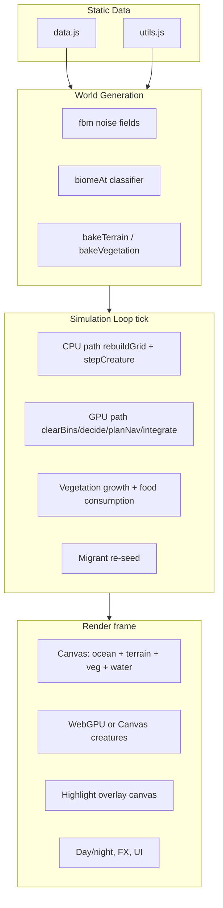

# Wildlands EcoSim — Agent Reference

> **Purpose:** Canonical design doc for AI agents working on this repo. Read this before scanning source. Update this file when architecture or simulation behavior changes.

## Quick Start

| Item | Value |
|------|-------|
| Entry point | `wildlands-ecosim.html` (serve over HTTP — ES modules block `file://`) |
| Modules | `js/` — ES module classes (see tree below) |
| Run | `python serve.py` from repo root → `http://127.0.0.1:8765/wildlands-ecosim.html` |
| Batch test | `http://127.0.0.1:8765/batch-test.html` — headless ecology/balance runs (CPU default) |
| Batch CLI | `python scripts/run_batch.py --days 100 --size s` · GPU: `python scripts/run_batch_gpu.py --days 100 --size s` or `--sim gpu` |
| Stack | Vanilla JS ES modules, Canvas 2D + WebGPU compute simulation + WebGPU creature overlay |
| Game design | `GAMEPLAY.md` — player-facing rules and planned Challenge mode |

```
EcoSim/
├── wildlands-ecosim.html   # HTML/CSS shell + DOM (~480 lines)
├── batch-test.html         # Batch ecology/balance test runner UI
├── serve.py                # Threaded static server + batch report API
├── config/
│   └── timeline-config.json # Snapshot interval override (loaded at boot)
├── reports/                # Saved batch/fuzz JSON reports (gitignored *.json)
├── scripts/
│   ├── run_batch.py        # Headless CLI driver (Playwright)
│   └── run_batch_gpu.py    # GPU-focused batch CLI wrapper
├── tests/
│   ├── time-scrub.test.js  # Snapshot/scrub unit tests (console)
│   └── timeline-viewport.test.js # Viewport zoom/pan unit tests (console)
├── js/
│   ├── batch/              # Batch harness, metrics, fuzzer, balance UI, saved-runs table, campaign detail
│   ├── app.js              # GameApp boot + main loop
│   ├── state.js            # Shared mutable state + grid helpers
│   ├── config.js           # loadTimelineConfig() from JSON
│   ├── perf-policy.js      # High-speed snapshot/readback/timeline pressure scaling
│   ├── perf-profiler.js    # Frame/sim/render timing collector + Profiler panel data
│   ├── creature-notify.js  # Death-cause refinement, killer inference, World Story formatting
│   ├── dom.js              # DOM helper ($)
│   ├── data.js             # Biome enums + loadSpeciesData() from JSON
│   ├── data/
│   │   ├── species.json    # Species stats, gestation, mate cooldown, genes
│   │   └── behaviors/      # BT library + per-species behavior JSON
│   ├── behavior/           # BehaviorTree — loader, evaluator, executor (CPU)
│   │   ├── loader.js       # Merge library + species overrides
│   │   ├── context.js      # Per-tick perception context
│   │   ├── conditions.js   # JSON condition ops
│   │   ├── evaluator.js    # Selector/sequence walker
│   │   ├── executor.js     # Goal/action application
│   │   └── state-codes.js  # CPU/GPU state code mapping
│   ├── utils.js            # Seeded RNG, fbm noise (exported functions)
│   ├── nav.js              # Passability, LOS, windowed A* pathfinding
│   ├── world.js            # World — procedural generation + veg growth
│   ├── camera.js           # Camera — pan/zoom/clamp transforms
│   ├── creatures.js        # CreatureSystem — AI, genetics, spatial hash, display smoothing
│   ├── life-story.js       # LifeStory — per-creature timeline (state enter/exit + milestones) + serialize
│   ├── simulation.js       # Simulation — tick, day/night, optional migrants, heartbeat snapshots
│   ├── snapshot.js         # Snapshot capture/restore + reconcileSelectionAfterRestore
│   ├── time-scrub.js       # TimeScrubController — slider seek, baseline, fork+truncate
│   ├── panel-layout.js     # Draggable panel position persistence (localStorage)
│   ├── species-stats.js    # Per-species birth/death counters + death-cause aggregation
│   ├── ui.js               # UI — panels, inspector, graph, World Story + Timeline DB + scrub + GOD menu
│   ├── timeline-viewport.js # TimelineViewport zoom/pan + sim-time clock helpers
│   ├── timeline-renderer.js # Canvas day-night strip + viewport tick layout
│   ├── timeline-db.js      # IndexedDB timeline storage (world events, creature events, heartbeats, snapshots)
│   ├── input.js            # InputManager — canvas/panel/keyboard input
│   ├── tools.js            # Editor tools (spawn, rain, meteor, cull)
│   ├── fx.js               # Effects — spark/rain particles
│   ├── gpu-throttle.js     # Global GPU throttle presets (readback/render pacing)
│   ├── gpu-throttle-ui.js  # Shared top-bar throttle control
│   ├── gpu/
│   │   └── simulation-backend.js # GpuSimulationBackend — compute sim + readback bridge
│   └── render/
│       ├── terrain-renderer.js   # TerrainRenderer — terrain/water/veg bake
│       ├── creature-renderer.js  # CreatureRenderer — 2D sprites, highlights, pedigree
│       ├── webgpu-renderer.js    # WebGpuRenderer — instanced creature quads
│       ├── quality.js            # QualityController — adaptive perf tiers
│       └── pipeline.js           # RenderPipeline — layer orchestration
├── GAMEPLAY.md             # Game design doc (sandbox today + Challenge mode plan)
└── AGENTS.md               # This file
```

---

## Architecture Overview

Single-page sim: procedural tile world → CPU or GPU creature/world simulation tick → layered render.



**Global state lives in `js/state.js`** (`state` object) — modules import it and expose domain classes. `ready` gates sim/render after worldgen.

---

## World Model

### Grid

- **Tile arrays** (length `W * H`, index `idx(x,y) = y*W+x`):
  - `elev`, `temp`, `moist` — `Float32Array`
  - `biome` — `Uint8Array`
  - `veg`, `vegCap` — `Float32Array` (0..cap per tile)
- **World size presets** (`cfg.size`):

| Key | Area (km²) | Side (km) | Tiles/km | Default tiles |
|-----|------------|-----------|----------|---------------|
| `s` | 25 | 5 | 32 | 160×160 |
| `m` | 64 | 8 | 32 | 256×256 |
| `l` | 100 | 10 | 32 | 320×320 |
| `xl` | 400 | 20 | 32 | 640×640 |
| `xxl` | 900 | 30 | 24 | 720×720 |

- `worldKmPerTile = sideKm / sideTiles`
- Adaptive perf knobs scale with `W*H`: `TX` (terrain subpixels), `growStride`, `vegBakeInterval`

### Worldgen config (`cfg`)

```js
{ sea: 0.46, temp: 0.5, moist: 0.5, relief: 0.6, animals: 0.45, size: 'm' }
```

Sliders in left panel map to these. `SEED` drives `setRngSeed(SEED)` at generation.

### Elevation / climate / biomes

1. **Elevation:** 5-octave fbm + radial continental falloff (land clusters center) + relief-scaled detail
2. **Moisture:** fbm + global `cfg.moist`
3. **Temperature:** latitude gradient (cold poles) + altitude cooling above sea + noise + `cfg.temp`
4. **Biome:** `biomeAt(e,t,m)` — Whittaker-style temp×moisture bands + elevation thresholds (ocean/beach/mountain/peak/snow)
5. **Lakes:** inland tiles with `e < 0.62` and high lake-noise → `B.LAKE`

### Biome enum (`B` in `data.js`)

| ID | Name | Water | veg cap |
|----|------|-------|---------|
| 0–2 | Deep/Ocean/Lake | yes | 0 |
| 3 | Beach | no | 0.08 |
| 4–14 | Desert…Peak | no | 0.02–1.0 |

`isWater(b) => b <= B.LAKE`. Full colors/caps in `BIOME_INFO`.

---

## Creature Simulation

### Population limits

- `MAX_POP = 6000` hard cap for births/spawns
- Dead creatures pruned periodically (`creatures.filter`); selected dead creature kept for inspector
- `stockLife()` seeds scaled by density + world area (`sqrt(area/64)`), clamped to ~45% of `MAX_POP`

### Species (`data/species.json` via [`js/data.js`](js/data.js))

Loaded at boot with `loadSpeciesData()`. Each species entry includes `label`, `emoji`, `diet`, `shape`, `col`, `base` genes, `gestationSec` `[min,max]`, `mateCooldownSec` `[min,max]`, `stockWeight`, plus optional `hunts` / `preyOf`, `canSwim`, and `spawnNearWater`.

Helpers: `sampleGestation(sp)`, `sampleMateCooldown(sp)`, `sexSymbol(sex)`, `sexLabel(sex)`, `speciesCanSwim(s)` (`canSwim: true` or `shape: bird`).

| Key | Diet | Hunts | Prey of | Shape |
|-----|------|-------|---------|-------|
| rabbit, mouse | 0 herbivore | — | fox,wolf,hawk,owl,bear / fox,hawk,wolf,owl | small |
| deer, elk | 0 herbivore | — | wolf,bear | tall |
| beaver | 0 herbivore | — | wolf,bear | stocky (canSwim) |
| boar, bear | 2 omnivore | see data | wolf,bear / — | stocky |
| fox, wolf, hawk, owl | 1 carnivore | see data | — | small/tall/bird |

**Diet semantics:** `0` graze only · `1` hunt · `2` graze if no prey, else hunt/search

### Genome

- Keys: `size, speed, sense, metab, litter, lifespan, temp, tol, hue, agg`
- Ranges in `GENE_RANGE`; labels in `GENE_LABEL`
- **Spawn:** `newGenome(sp)` — species base ±12% gaussian (+ hue noise)
- **Breed:** `breedGenome(a,b)` — average + 5% mutation; 2% chance of 18% jump mutation

### Creature object

```js
{
  id, sp, x, y, vx, vy, dir, genome, gen,
  age, hp, hunger, thirst, energy,
  state, tx, ty, target, mateCd, pregnant, litterQ,
  walk, dead, cause,
  parentIds[], offspringIds[],
  matePartner?, matePartnerId?,
  sex,                   // 'female' | 'male' (random at birth/spawn)
  lifeStory?             // in-memory event log (see Life Story below)
}
```

- **Age:** `age += dt/24` → ~24 sim-seconds per game-year
- **Adult:** `age >= lifespan * 0.25`; juvenile size ×0.55
- **Effective size:** `eSize(c) = genome.size * (juvenile ? 0.55 : 1)`

### AI behavior trees (CPU)

Hybrid JSON-driven behavior trees in [`data/behaviors/`](data/behaviors/) + [`js/behavior/`](js/behavior/):

- **`library.json`** — shared conditions, actions, thresholds, base tree templates (`herbivore_prey`, `carnivore`, `omnivore`)
- **`{species}.json`** — `extends` template, threshold overrides, action tweaks, tree insert/remove patches
- Each species in [`data/species.json`](data/species.json) has a `"behavior"` key pointing to its behavior file stem
- **`BehaviorTree.tick()`** — builds perception context (`nearby` scan), walks selector/sequence nodes, returns first succeeding action
- **CPU path:** BT sets state + goals, then `applyActionEffects` runs graze/hunt/mate/etc.; **`resolveMovementTarget`** picks direct pursuit (live target position within ~4 tiles / LOS) or **`planGridStep`** (A*) for movement
- **GPU path:** BT runs on CPU each tick (`tickDecisionOnly`); `uploadBehaviorDecisions()` writes behavior goal to `sv.x/y`, target slot + state to `tv.z/w` (waypoints stay in `tv.x/y`); GPU runs `claimBehaviorTargets` → **`planNavStep` (A*)** → `resolveIntegrate` → **`resolveHuntDamage`** (predation). Hunt/mate use live target positions in `resolveIntegrate`; flee uses `sv` flee goals (not threat position).

**States** (unchanged labels): `flee` · `thirst` · `graze` · `hunt` · `huntSearch` · `rest` · `mate` · `wander`

**Perception:** `nearby(c, senseR)` via spatial hash. Night: speed ×0.6; `NightWanderTired` condition forces rest when energy <75.

**Movement:** Dynamic targets (hunt/flee/mate) use live entity float positions — not snapped tile centers — with **direct pursuit** when within `DIRECT_PURSUIT_RADIUS` (~4 tiles) or on LOS; otherwise windowed A* via **`resolveMovementTarget`** / **`planGridStep`** (8-connected, octile heuristic, corner-cutting guard). GPU `planNavStep` mirrors A* in WGSL; goals read from `sv.x/y`, waypoints written to `tv.x/y`; integrate overrides movement toward live target slot for flee/hunt/mate.

**Passability:** `BIOME_INFO[].passable` plus optional `state.passMask` (bit 0 = blocked). Packed into GPU `worldData` stride index 5 on upload.

**Predation / mating:** Same rules as before; CPU executes on CPU path; GPU `resolveIntegrate` on GPU path.

### Needs & death (`stepNeeds` / `resolveIntegrate`)

| Need | Decay | Empty penalty |
|------|-------|-----------------|
| hunger | `0.9*load` (+ hunt bonus) | hp −6/s |
| thirst | `1.0*load` | hp −7/s |
| energy | movement + base | capped at 0 |
| climate | stress if `\|localT - genome.temp\| > tol` | hp −14*stress/s |

- Heal +4 hp/s when hunger/thirst >55 and no climate stress
- Death: hp≤0, or age≥lifespan
- Carcass: +0.15 veg on tile
- CPU: `stepNeeds()` in `stepCreature`; GPU: `resolveIntegrate`

### Life story (`lifeStory` on creature)

Each creature carries an append-only in-memory log via [`js/life-story.js`](js/life-story.js):

- **`lifeStory.events[]`** — JSON-serializable entries (`seq`, `t`, `day`, `age`, `kind`, optional `decision`, `from`, `targetId`, `targetSp`, `detail`); capped at 300 (oldest dropped).
- **Kinds:** `appeared` · `born` · `decision` · `stateEnter` · `stateExit` · `mated` · `gaveBirth` · `hunted` · `preyedOn` · `drank` · `rested` · `wandered` · `grazed` · `stage` · `died`
- **Debounced decisions:** AI state commits after `DECISION_DEBOUNCE_SEC` (2.5 sim s) in the same behavior; rapid oscillation (e.g. flee ↔ wander) is not logged per frame.
- **CPU hooks:** `stepCreature` → `observeDecision` / `observeAge`; `die`, `giveBirth`, mate, hunt → immediate `record()` calls.
- **GPU hooks:** `consumeCreatureReadback` / `consumeSelectedReadback` → `observeFromSnapshot` (state debounce + inferred milestone transitions).
- **Persistence:** every life event is mirrored into IndexedDB (`timeline-db.js` `creatureEvents` store) with per-world `runId`.
- **GPU gaps:** GPU-born slots use synthetic ids; pedigree empty on GPU path; hunt may log `preyedOn`/`died` on prey without predator `hunted`.

### Spatial hash

- `CELL = 6`, `grid: Map<gkey, Creature[]>`
- `rebuildGrid()` each tick before creature steps
- `nearby(c, r)` queries cell neighborhood
- GPU backend uses a uniform-cell bin buffer (`cellCounts`, fixed-cap `cellEntries`) for local neighbor scans

### Vegetation

- **Graze:** bite up to `3.5*dt` veg; hunger += bite×26; sets `vegDirty`
- **Growth:** one row per tick (`growRow`), rate `cap * 0.22 * dt * growStride * (0.6+moist)`
- **Bake:** `bakeVegetation()` when dirty (throttled by `vegBakeInterval`)
- GPU backend treats vegetation as tangible food-state buffers (`veg`, `vegCap`) with deterministic tile-owner claims before bite writes

### Migrant system (every ~6s, opt-in)

Gated by `state.autoMigrationEnabled` (sandbox default `false`) or `batchConfig.autoMigration` in batch mode. When enabled, if species count ≤1 and total pop <70% MAX_POP:
- Herbivores: 60% chance, spawn 2–3
- Predators: 25% chance, spawn 1, only if prey species count >2

Prevents permanent food-web collapse when enabled.

### Time

- `timeOfDay` cycles in 40s (`dt/40` per tick) → `day = floor(tGlobal/40)`
- `lightLevel`, `isNight` affect movement/rest only (not sim correctness)

### Time scrub & timeline (`time-scrub.js`, `snapshot.js`, `timeline-db.js`, `timeline-viewport.js`, `timeline-renderer.js`)

- **Snapshots** — `captureSnapshot()` every `effectiveSnapshotIntervalSec()` sim-seconds of `tGlobal` (equals `state.snapshotIntervalSec`, overridden at boot by [`config/timeline-config.json`](config/timeline-config.json), default 1 s in JSON / 10 s in `state.js` before load; **not** scaled by speed multiplier); stored in IndexedDB `snapshots` store without app-level count cap (browser quota applies); snapshot writes are never dropped from the timeline queue
- **Timeline UI** — canvas day-night strip (`#top-scrub-canvas`) under tick marks; `TimelineViewport` zoom (wheel), pan (MMB/RMB drag), seek (LMB drag); hover tooltip (`#timeline-tip`) shows day, 12-hour clock, and dawn/day/dusk/night icon; double-click track resets zoom
- **Heartbeats** — compact metrics rows every `effectiveHeartbeatIntervalSec()` (scales at speed ≥4×)
- **Scrub controller** — `TimeScrubController.seekTo()` restores nearest snapshot ≤ target; `goToPresent()` restores baseline; `onMutatingAction()` calls `truncateFuture` and forks timeline when tools/GOD actions run while viewing past
- **Seek UX** — rAF-debounced slider seeks use `light: true` while dragging; snapshot row cache warmed from IndexedDB on first seek; scrub meta persisted to IndexedDB (`persistScrubMeta`)
- **While scrubbing** (`state.scrubActive`): sim does not advance; GPU creature/world readback skipped; render authority is `cpu_snapshot`; species row lock + selection restored via `reconcileSelectionAfterRestore()` (dead selection cleared when following)
- **Render while scrubbing** — WebGPU path keeps circle LOD when zoomed out; at sprite LOD uses `scrub-canvas-sprites` branch; species/selection highlights remain via `effectiveHighlight`

### High-speed perf policy (`perf-policy.js`)

At sim speed ≥5×, reduces overhead without changing sim correctness:

| Helper | Effect |
|--------|--------|
| `effectiveSnapshotIntervalSec()` | Fixed sim-time snapshot cadence (`snapshotIntervalSec`, not speed-scaled) |
| `effectiveHeartbeatIntervalSec()` | Scales heartbeat cadence at speed ≥4× |
| `shouldRunBehaviorThisSubstep()` | BT decisions only on last substep at speed ≥5× |
| `effectiveReadbackEveryMs()` | GPU readback interval × speed/tier |
| `effectiveScrubTickRefreshMs()` | Fixed 800 ms scrub tick mark refresh interval |
| `shouldPersistCreatureEvent()` | Drops non-milestone creature events at speed ≥5× (except selected creature) |
| `timelineWritePressure()` | `low` / `medium` / `high` — timeline DB may drop writes under pressure (`gpuTelemetry.droppedTimelineWrites`) |

### Creature display smoothing (`creatures.js`)

- Render positions `rx/ry` lerped toward sim `x/y` via `advanceDisplayPositions(dt)`
- **GPU extrapolation** — when live and `gpuDisplayExtrapolate`, positions advance by `vx/vy` between readbacks; disabled on pause, re-enabled after `forceCreatureReadback()` on resume
- **Scrub** — faster smoothing (`expSmoothT` 10 vs 16); walk animation continues from restored snapshot state

### Death notifications (`creature-notify.js`)

- `refineDeathCause()` — maps exhaustion to starvation/dehydration/old age when applicable
- `inferKillerId()` — GPU hunt target slot + life-story `preyedOn` fallback
- `formatBornEvent` / `formatMatedEvent` / `formatDiedEvent` — World Story HTML strings with sex symbols

## Rendering

### Canvases

| Element | z-index | Role |
|---------|---------|------|
| `#world` | 1 | Terrain, water, veg, 2D creatures (detail path), day/night tint, FX, tool ring |
| `#world-gpu` | 2 | WebGPU instanced creature circles (transparent overlay) |
| `#world-hl` | 3 | Species/selection highlight glows above GPU layer (`pointer-events: none`) |

### Profiler panel (`#profiler-panel`)

Draggable panel toggled via top-bar **Profiler** button or **F2** (`localStorage` key `ecosim-profiler-open`). Replaces the old bottom-left `#perfhud` overlay.

- **Overview** — FPS, frame ms, quality tier, sim/render backend badges, frame-time sparkline
- **Frame budget** — stacked bar + per-bucket ms for sim / snapshot / displaySmooth / render / ui / other
- **CPU Simulation** (default sandbox) — `rebuildGrid`, `stepCreatures`, `vegGrow`, `migrant`, `pruneDead`, `heartbeat`
- **GPU Simulation** (when `simBackend==='gpu' && gpuSimEnabled`) — behavior tree, upload, gpu step, per-pass encoding, readback
- **Rendering** — terrain, collectVisible, creatures, pedigree, overlay; branch + LOD + visible count
- **GPU Rendering** (when `rendererBackend==='webgpu'`) — `webgpuPack`, `webgpuSubmit`
- **Timeline** — snapshot capture ms, IndexedDB queue depth, dropped writes
- **Context** — `simulationMode`, world size, speed, substeps, scrub/pause, veg bake interval

Instrumentation lives in [`js/perf-profiler.js`](js/perf-profiler.js). Top-level buckets (`frameTotal`, `sim`, `render`) always record; detailed keys only when the summary panel is open. GPU sim sub-pass timing is zero-cost when CPU sim is the active backend.

### CPU/GPU detail panel (`#profiler-detail-panel`)

Docked to the **right** of `#profiler-panel` when the summary panel is open (repositions when the summary panel is dragged or the window resizes); otherwise anchors to the top-right of the viewport. Toggled independently via the top-bar **CPU/GPU** button (`localStorage` key `ecosim-profiler-detail-open`). **F2** opens only the summary panel; detail does not auto-open.

- **CPU tab** — hierarchical call tree (Name, Calls, Total ms, Self ms, % of parent); expandable rows; top 200 nodes by total ms (EMA-aggregated; inactive scopes decay toward zero each frame)
- **GPU tab** — draw calls, instances, compute dispatches, buffer uploads (KB/frame), buffer transfers, estimated VRAM (tracked buffer sizes), submit time, async GPU-done estimate, load % estimate, renderer backend, device `maxBufferSize`

**Detail gating:** `perfProfiler.setDetailEnabled(true)` activates scope-stack instrumentation and per-frame GPU counters. When off, `enterScope` / `scope` / per-creature scopes are zero-cost no-ops.

**Scope naming** (representative paths):

| Scope | Source |
|-------|--------|
| `frame` → `frame.sim` / `snapshot` / `displaySmooth` / `render` / `ui` | `app.js` |
| `sim.tick` → `sim.rebuildGrid`, `sim.stepCreatures`, `sim.vegGrow`, … | `simulation.js` |
| `creature.stepCreature` → `creature.stepNeeds`, `creature.behavior` | `creatures.js` |
| `behavior.decide` → `behavior.buildContext`, `behavior.evaluateTree`, `behavior.execute` | `behavior/index.js` |
| `behavior.action.{state}` | `behavior/executor.js` |
| `nav.planGridStep` | `nav.js` |
| `render.*`, `render.webgpuPack`, `render.webgpuSubmit` | `pipeline.js`, `webgpu-renderer.js` |
| `snapshot.capture` | `snapshot.js` |
| `timeline.append` | `timeline-db.js` |
| `ui.update` | `ui.js` |

**GPU counter semantics** (reset each frame when detail open):

| Counter | Meaning |
|---------|---------|
| `renderDrawCalls` | Each `pass.draw()` in WebGPU creature renderer |
| `renderInstances` | Instance count summed across draws |
| `computeDispatches` | Each `dispatchWorkgroups` in GPU sim (+ render compute if any) |
| `bufferUploadBytes` | Bytes written via `queue.writeBuffer` |
| `bufferTransfers` | `copyBufferToBuffer` ops (readback path) |
| `bufferMemoryBytes` | Running total at buffer creation/resize (estimate, not driver VRAM) |
| `submitMs` | `render.webgpuSubmit` + `gpu.encode` (when GPU sim active) |
| `gpuSubmitDoneMs` | Async `onSubmittedWorkDone` wall time (1-frame lag) |
| `gpuLoadPct` | `gpuSubmitDoneMs / frameTotalMs × 100` (labeled estimate in UI) |

### Layers (bottom → top)

1. **Infinite ocean** — off-map deep water via `drawInfiniteOcean()` (cached viewport)
2. **Terrain** — pre-baked `terrC` at `TX` subpixels/tile, pixel-art flecks
3. **Vegetation** — 1px/tile green overlay, alpha ∝ veg/cap
4. **Water shimmer** — animated `waterC`, shoreline foam, fps scaled by quality
5. **Creatures** — WebGPU instanced circles OR Canvas pixel sprites (LOD by zoom + quality tier); dim less at night than terrain; selected + pedigree stay full brightness
6. **Species/selection highlights** — glow rings on `#world-hl` (WebGPU circle path) or `#world` (Canvas / zoomed sprite path); never disabled when panel hover, species lock, or creature selection is active (see `effectiveHighlight`)
7. **Selection relation lines** — solid behavior-target line (selected creature only; color by behavior) + animated pedigree dashes to parents (gold) and offspring (blue); drawn on `#world` (may sit under GPU circles when WebGPU path is active)
8. **FX** + tool brush ring

### WebGPU hybrid (`rendererMode='webgpu_hybrid'`)

- Falls back to Canvas if no `navigator.gpu`
- `simulationMode='cpu'` is the sandbox default; set to `'gpu_hybrid'` to enable GPU simulation when WebGPU is available (fallback is CPU simulation)
- **Creature render paths** (chosen each frame in `RenderPipeline.render()`):
  1. **`webgpu_circles`** (default under load / normal zoom) — GPU draws filled circles; highlights on `#world-hl` via `renderHighlightsOverlay()`
  2. **`webgpu_canvas_sprites`** — when `detail >= 2 && cam.z > 4.2`: GPU overlay cleared, full Canvas pixel sprites + highlights on `#world`
  3. **`scrub-canvas-sprites`** — while `state.scrubActive` at sprite LOD: Canvas sprites from restored CPU snapshot (GPU overlay hidden)
  4. **`canvas`** — full Canvas fallback if GPU init/submit fails
- In GPU sim mode, compute writes a render buffer directly and `WebGpuRenderer.renderGpuBuffer()` draws without CPU repacking creature instances
- Compute uses **one bind group, 8 storage buffers + 1 uniform** (WebGPU per-stage limit): `creatures`, packed `worldData` (temp/moist/veg/cap/biome), `cellCounts`, `cellEntries`, packed `simAtomics` (counters/species sums/prey+food owners), `simLists` (alive/dead/birth), read-only `speciesTables`, `renderData`, plus `params` uniform
- **Compute pass order** (`GpuSimulationBackend.step()`): `clearCells` → `clearCounters` → `binCreatures` → **`claimBehaviorTargets`** → **`planNavStep` (A*)** → `resolveIntegrate` → `spawnFromBirthQueue` → `growVegetation` → `composeRenderData`
- **CPU BT before GPU step:** `rebuildGrid()` → `behaviorTree.tickDecisionOnly()` per creature → `uploadBehaviorDecisions()`
- While GPU sim is initializing (`gpuSimInitPending`), CPU creature ticks are skipped so seeded populations are not depleted before upload
- GPU creature records now keep stable `gpuSlot` indices; CPU sync writes changed slots only (no full stale re-upload each tick), which prevents migration/prune snap-back
- GPU behavior state is decoded from compute state codes (`wander/flee/thirst/graze/hunt/rest/mate/huntSearch`) for inspector/tooltips instead of showing a raw `gpu` placeholder
- **Scrub / pause** — GPU sim stepping and readback skipped while `state.scrubActive`; **Spacebar** pause sets `gpuDisplayExtrapolate=false` and snaps display positions; resume forces readback then re-enables extrapolation
- Large populations + poor FPS → quality tier rises → creatures simplify to circles/markers (intentional LOD, not a bug)
- **F2** toggles the **Profiler** panel (`#profiler-panel`)

### Quality tiers (`QualityController` in `quality.js`)

Rolling average frame time (`frameMsAvg`, lerp α=0.12) maps to tiers:

| Tier | Name | `frameMsAvg` | detail | highlight | decimation |
|------|------|--------------|--------|-----------|------------|
| 0 | high | ≤16.8 ms | 2 | 2 | 1 |
| 1 | medium | ≤22 ms | 1 | 1 | 1 |
| 2 | low | ≤30 ms | 1 | 0 | 1 |
| 3 | emergency | >30 ms | 0 | 0 | 2 |

- **`detail`** — creature sprite LOD (see Creature LOD below)
- **`highlight`** — `0` = off · `1` = simple stroke rings · `2` = animated glow (`drawCreatureHighlight`)
- **`decimation`** — skip every other render frame at tier 3
- Also scales water animation rate and `vegBakeInterval`

**`effectiveHighlight(baseHighlight)`** — returns `max(baseHighlight, 1)` when `hoveredGraphSpecies`, `lockedSpeciesFromPanel`, or a live `selected` creature is set. Keeps map species/selection highlights visible even at tier 2–3.

### Camera

- `cam = {x, y, z}` — world coords + zoom
- `w2sX/Y`, `s2wX/Y` transforms
- Clamped to `landBounds` with minimum visible land margin
- Pan: right/middle drag; zoom: wheel; follow: centers on `selected`

### Creature LOD

Driven by quality `detail` tier and `cam.z`:

| Condition | Draw |
|-----------|------|
| detail 0 or zoom <1.8 | 1px marker (Canvas) / small circle (WebGPU) |
| detail 1, zoom <3.5 | simple rect body (Canvas) / medium circle (WebGPU) |
| else | full pixel-art sprite by `shape` (Canvas only; requires `detail >= 2 && cam.z > 4.2` on WebGPU path) |
| zoom >6 | state emoji above creature |

---

## UI & Input

### Panels (draggable via `.panel-head`)

Panel positions are saved to `localStorage` key `ecosim-panel-layout` on drag end and restored on boot/resize via [`js/panel-layout.js`](js/panel-layout.js). Invalid or missing entries fall back to CSS default positions (below the top bar).

| Panel | ID | Purpose |
|-------|-----|---------|
| World Generator | `#genpanel` | Seed, size, sliders, Generate, Restock |
| Ecosystem | `#stats` | Pop counts, graph, species row selection |
| Species Stats | `#speciestats` | Per-species graph, avg needs, pop/death stats (visible when species row clicked) |
| World Story | `#worldstory` | Collapsible, scrollable, clickable world event timeline |
| Timeline DB | `#timelinedb` | Collapsible DB browser for world/creature/heartbeat rows in current run |
| Profiler | `#profiler-panel` | CPU/GPU frame budget breakdown (F2 or top-bar toggle) |
| CPU/GPU detail | `#profiler-detail-panel` | Call tree + GPU metrics (top-bar **CPU/GPU** toggle) |
| Inspector | `#inspect` | Selected creature stats/genes + **Life Story** tab |

### Top bar stats

Day/night, population, max generation, avg vegetation %, speed slider (0–10×), Follow button, **Profiler** button, **Test Runner** link, and the **timeline scrub** bar (`#top-scrubctl`) with zoomable/pannable canvas day-night strip, snapshot tick marks, play/pause indicator (Spacebar), 12-hour clock, and **Present** button.

### Species GOD menu (`#species-row-menu`)

- **Right-click** species row in Ecosystem panel → context menu titled `{emoji} {label} GOD`
- **Kill All** — `creatures.killAllBySpecies()`; logs World Story event; calls `timeScrub.onMutatingAction()` when viewing past
- **Escape** closes menu; left-click species row still locks gold highlight

### Ecosystem panel (`#stats`)

- **Panel modes** (`statsPanelMode`): normal · minimized (`−`) · maximized (`□`)
- **Pop graph** — species-colored lines; updates every 5 UI ticks (~1 Hz)
- **Maximized graph** — taller canvas (220 px), hover crosshair + `#popgraph-tip` sample tooltip
- **Species rows** — population count only; click/hover for map highlights (see Selection)

### Species Stats panel (`#speciestats`)

- **Visibility** — shown when a species row is **left-clicked** (`lockedSpeciesFromPanel`); hidden on click-away deselect
- **Collapse** — starts expanded; independent of Ecosystem panel collapse
- **Population graph** — single-species line from `state.popHistory[sp]` on `#speciestats-graph`
- **Average needs** — mean Health / Fullness / Hydration / Energy across living members (same `.needlab`/`.needbar` UI as inspector)
- **Summary stats** — current pop, total deaths, total ever lived, birthrate (births in last 1 sim-day / 40 sim-seconds)
- **Death causes** — aggregated `deathsByKey` sorted by count; predation broken out by killer species emoji
- **Tracking** — [`js/species-stats.js`](js/species-stats.js) hooks via `lifeStory.recordAppeared` / `recordBorn` / `recordDied`; resets on world generate (not timeline scrub)

### Selection & map overlays

- Click creature (inspect tool) → inspector
- Double-click or **F** → follow camera (`followSelected`); camera tracks selected via `Camera.followSelected()`
- Species row **click** → lock species map/graph focus (`lockedSpeciesFromPanel`); gold glow on all of that species on map
- Species row **double-click** → lock species, jump camera to nearest living member of that species (relative to viewport center), select it, and enable follow
- Species row **hover** → `hoveredGraphSpecies`; graph line + row outline highlight; blue glow on all of that species on map (persists at low quality via `effectiveHighlight`)
- `lockedSelectionFromPanel` prevents canvas click from clearing until click-away
- **Terrain tooltip** (`#terrain-tip`, bottom-right) — biome name + color dot under cursor; shows "Off map" outside grid
- **Creature tooltip** (`#creature-tip`) — species dot + behavior label above sprite; when following, pins to selected creature instead of hover hit-test
- Selected creature draws a solid behavior-target line (color by state) + animated pedigree dashes to parents (gold) and offspring (blue) via `CreatureRenderer`

### Inspector tabs (`inspectPanelTab`)

- **Stats** (default) — generation + need bars + genome grid (`#inspect-tab-stats`); header shows species name plus sex badge (large ♂/♀ icon + Male/Female label)
- **Life Story** — scrollable debounced decision + milestone timeline (`#i-story`, newest first); clickable creature links when target still alive
- Tab bar mirrors stats panel `.btn.active` pattern; resets to Stats on new selection

### World Story panel (`#worldstory`)

World notifications now stream into the **World Story** panel as persistent rows instead of temporary toasts. Rows remain clickable (`focusCreatureFromEvent`) and are mirrored into IndexedDB `worldEvents` for future rewind tooling.

### Timeline DB panel (`#timelinedb`)

`Timeline DB` is a readonly, paginated viewer over IndexedDB stores (`worldEvents`, `creatureEvents`, `heartbeats`, `meta`) for the active run, with tabbed filters and click-to-focus links for creature-related rows.

### Heartbeat snapshots

`simulation.tick()` periodically writes compact world snapshots to IndexedDB `heartbeats` (`effectiveHeartbeatIntervalSec()`, base `heartbeatIntervalSec` default 5 s) as rewind anchors.

Full state snapshots (vegetation + creatures) are captured every `effectiveSnapshotIntervalSec()` sim-seconds into the `snapshots` store to power the interactive timeline scrub bar (even tick spacing at any speed). Interval is `state.snapshotIntervalSec` (overridden at boot from [`config/timeline-config.json`](config/timeline-config.json)). Scrubbing restores a prior snapshot; mutating tools or GOD actions while viewing the past call `truncateFuture` and fork the timeline. Viewport zoom/pan is persisted in scrub meta.

### Migrant reseed toggle

Automatic migrant reseed is now gated by `state.autoMigrationEnabled` (default `false`) for semi-closed ecosystems. Manual god-actions (`Restock`, spawn tools) remain available.

### Tools (code present; toolbar HTML currently absent)

Default `tool='inspect'`. Implemented in `applyTool()`:

- `inspect` — select creature
- `spawn-{species}` — spawn on land
- `rain` / `drought` — fill/clear veg in radius 4
- `meteor` — kill creatures + scorch veg, radius 3
- `cull` — kill in radius 1.5

CSS for `#toolbar` exists; DOM toolbar was removed or not yet added. Re-add `<div id="toolbar">` with `.tool[data-tool=…]` buttons to expose tools.

### Sim speed

- `speed` 0–10×; high speeds use up to 6 substeps per frame for AI stability
- **Spacebar** toggles pause (`speed=0`, `pausedBySpace=true`) and restores `lastSpeedBeforePause`
- `tGlobal` accumulates scaled dt; sim paused at speed 0 or while scrubbing past (`timeScrub.isViewingPast()`)

---

## Key Functions (by file)

### `js/utils.js`

| Export | Role |
|--------|------|
| `setRngSeed`, `rng`, `ri`, `rf`, `pick`, `gauss` | Seeded PRNG |
| `clamp`, `lerp` | Math helpers |
| `hashN`, `vnoise`, `fbm` | Procedural noise |

### `js/data.js`

| Export | Role |
|--------|------|
| `B`, `BIOME_INFO`, `isWater` | Biome definitions |
| `SPECIES`, `SP_KEYS` | Species catalog |
| `SPECIES_INDEX`, `buildGpuSpeciesTables()` | GPU species lookup tables |
| `GENE_KEYS`, `GENE_RANGE`, `GENE_LABEL` | Genetics |

### `js/nav.js`

| Export | Role |
|--------|------|
| `isTileWalkable`, `tilePassFlags`, `buildPassMaskUpload` | Passability from biome + `passMask` |
| `lineOfSightClear` | Bresenham walkability check |
| `snapWalkableGoal`, `nearestWaterEdgeTarget`, `pickRandomWalkableTile` | Goal selection helpers |
| `planGridStep` | Windowed A* next-step planner (CPU; mirrored in GPU WGSL) |
| `resolveMovementTarget` | Direct pursuit for close/LOS goals, else `planGridStep` |
| `unsnappedWalkableGoal` | Live float goal; snap only when entity tile impassable |
| `atWaterEdge` | Shoreline drink detection |

### `js/perf-profiler.js`

| Export | Role |
|--------|------|
| `perfProfiler` | EMA timers, ring-buffer sparklines, `getSnapshot()`, `enabled` / `detailEnabled` gating |
| `setDetailEnabled(on)` | Gates scope stack + GPU counters (detail panel) |
| `scope(name, fn)` / `enterScope` / `exitScope` | Hierarchical CPU call tree when detail open |
| `getCpuTree()` / `getGpuSnapshot()` | Detail panel data (included in `getSnapshot()`) |
| `recordGpuDraw`, `recordGpuDispatch`, `recordGpuUpload`, `trackBufferMemory` | Per-frame GPU counters |
| `isGpuSimActive()` | `state.simBackend === 'gpu' && state.gpuSimEnabled` |

Key timing buckets: `frameTotal`, `sim`, `snapshot`, `displaySmooth`, `render`, `ui`, `sim.rebuildGrid`, `sim.stepCreatures`, `render.terrain`, `render.webgpuPack`, `gpu.pass.*` (GPU sim only).

### `js/perf-policy.js`

| Export | Role |
|--------|------|
| `effectiveSnapshotIntervalSec` | Fixed sim-time snapshot cadence (`snapshotIntervalSec`) |
| `effectiveHeartbeatIntervalSec` | Speed-scaled heartbeat cadence |
| `shouldRunBehaviorThisSubstep` | Skip BT on early substeps at high speed |
| `effectiveReadbackEveryMs` | GPU readback throttle multiplier |
| `effectiveScrubTickRefreshMs` | Scrub tick UI refresh interval (800 ms) |
| `shouldPersistCreatureEvent` | Milestone-only creature events at high speed |
| `timelineWritePressure` | IndexedDB write pressure tier |

### `js/config.js`

| Export | Role |
|--------|------|
| `loadTimelineConfig` | Fetch `config/timeline-config.json` at boot |

### `js/creature-notify.js`

| Export | Role |
|--------|------|
| `refineDeathCause`, `inferKillerId` | Death attribution for life story + World Story |
| `formatBornEvent`, `formatMatedEvent`, `formatDiedEvent` | World Story HTML formatters |
| `eventFocusIds` | Click targets for death events (prey + killer) |

### Domain modules (classes)

| Module | Class | Role |
|--------|-------|------|
| `world.js` | `World` | `generate`, `biomeAt`, `computeLandBounds`, `growVegetation` |
| `camera.js` | `Camera` | pan/zoom, `w2s`/`s2w`, `clampCam`, `centerCam` |
| `creatures.js` | `CreatureSystem` | `makeCreature`, `stepCreature`, `stepNeeds`, genetics, spatial hash, display smoothing, `killAllBySpecies` |
| `behavior/` | `BehaviorTree` | JSON-driven BT loader, evaluator, executor |
| `life-story.js` | `LifeStory` | debounced decision log, milestone events, `serializeCreature` / `serializeAll` |
| `species-stats.js` | — | `initSpeciesStats`, `recordSpeciesBirth`/`Death`, `getSpeciesStats`, death-cause display |
| `snapshot.js` | — | `captureSnapshot`, `restoreSnapshot`, `reconcileSelectionAfterRestore` |
| `time-scrub.js` | `TimeScrubController` | seek, present, fork+truncate, scrub meta persistence |
| `simulation.js` | `Simulation` | `tick`, day/night, heartbeat capture, optional migrant pulse |
| `render/terrain-renderer.js` | `TerrainRenderer` | `bakeTerrain`, `bakeWater`, `bakeVegetation`, infinite ocean |
| `render/creature-renderer.js` | `CreatureRenderer` | `drawCreature`, `renderHighlights2d`, `renderHighlightsOverlay`, pedigree lines |
| `render/webgpu-renderer.js` | `WebGpuRenderer` | WebGPU instanced creature circles |
| `render/quality.js` | `QualityController` | adaptive tiers, `effectiveHighlight` |
| `render/pipeline.js` | `RenderPipeline` | `render()` layer orchestration (3 canvases) |
| `gpu/simulation-backend.js` | `GpuSimulationBackend` | compute simulation passes, spatial bins, global awareness, conflict resolution, readback; exports `gpuBehaviorToState()` |
| `ui.js` | `UI` | stats, graph, inspector (Stats + Life Story), World Story, Timeline DB, interactive timeline scrub, species GOD menu, terrain/creature/timeline tooltips |
| `input.js` | `InputManager` | canvas/panel/keyboard handlers; **F2** Profiler panel; **Spacebar** pause |
| `app.js` | `GameApp` | boot, `doGenerate`, `frame` loop; exposes `window.runGpuBenchmark(seconds)` in console |

---

## Tuning Knobs (common agent edits)

| Constant | Location | Effect |
|----------|----------|--------|
| `MAX_POP` | `state.js` | Population ceiling |
| `CELL` | `state.js` | Spatial hash cell size |
| `GPU_SIM_MAX_CREATURES` | `state.js` | GPU creature pool cap |
| `simBackend` / `simulationMode` | `state.js` | CPU/GPU simulation routing |
| Need decay rates | `stepCreature` | Survival difficulty |
| Catch probability | hunt case ~1014 | Predator efficiency |
| `growStride`, veg growth 0.22 | `growVegetation` | Regrowth speed |
| Migrant timer/thresholds | `tick` ~1126 | Extinction recovery |
| Quality tier thresholds | `quality.js` `updateTier` | Perf vs fidelity (detail, highlight, decimation) |
| `effectiveHighlight` | `quality.js` | Panel hover/lock/selection highlight floor |
| `navRadius` / `navReplanInterval` | `quality.js` | Pathfinding search radius and replan cadence (GPU params 13–14) |
| `snapshotIntervalSec` / `config/timeline-config.json` | `state.js` / boot | Base snapshot capture interval for time scrub |
| `heartbeatIntervalSec` | `state.js` | Base heartbeat metrics interval |
| `autoMigrationEnabled` | `state.js` | Sandbox migrant reseed gate (default `false`) |
| `perf-policy.js` helpers | `perf-policy.js` | High-speed snapshot/readback/timeline scaling |
| `gpuDisplayExtrapolate` | `state.js` | GPU position extrapolation between readbacks |
| `DECISION_DEBOUNCE_SEC` | `life-story.js` | Min time in a behavior before logging a decision |
| `MAX_LIFE_EVENTS` | `life-story.js` | Per-creature event ring buffer size |
| Species `base` / `hunts` / `preyOf` | `data.js` | Food web balance |

---

## Code Conventions

- **ES modules:** each domain in `js/`; html loads `js/app.js` only
- **No bundler/CI** — edit and refresh browser; scrub tests in [`tests/time-scrub.test.js`](tests/time-scrub.test.js) via `window.runTimeScrubTests()` in console
- **Naming:** camelCase functions/vars; ALL_CAPS for enums/constants (`B`, `MAX_POP`, `SPECIES`); domain logic in PascalCase classes
- **Braces:** Allman style for multi-line functions/classes
- **Performance patterns:** Typed arrays for grids; row-scanned veg growth; baked terrain; viewport culling; optional GPU instancing

---

## Extension Guide for Agents

### Add a species

1. Add entry to `species` in [`data/species.json`](data/species.json) (diet, base stats, hunts/preyOf, shape, col, gestationSec, mateCooldownSec, stockWeight)
2. `SP_KEYS` auto-updates on next `loadSpeciesData()`
3. Add spawn weight in `CreatureSystem.stockLife()` plan object if desired
4. Optional: toolbar spawn button `data-tool="spawn-{key}"`

### Add a biome

1. Add to `B` enum + `BIOME_INFO` in `data.js`
2. Extend `World.biomeAt()` in `js/world.js`
3. Optional: terrain fleck rules in `TerrainRenderer.bakeTerrain()`

### Add a gene

1. Add to `GENE_KEYS`, `GENE_RANGE`, `GENE_LABEL` in `data.js`
2. Add base value in each species `.base`
3. Use in `stepCreature` or rendering as needed
4. Inspector auto-lists `GENE_KEYS`

### Mark a tile impassible

1. Set `state.passMask[idx(x,y)] |= 1` (see `PASS_GROUND_BLOCKED` in `nav.js`)
2. If GPU sim active, call `gpuSimulationBackend.uploadWorld()` to refresh passability buffer
3. Pathfinding (`planGridStep` / GPU `planNavStep`) will route around blocked tiles automatically

### Add a behavior override

1. Add or edit [`data/behaviors/{species}.json`](data/behaviors/) — `extends`, `thresholds`, `actions`, `tree` patches
2. Reference from species via `"behavior": "{stem}"` in [`data/species.json`](data/species.json)
3. Shared nodes live in [`data/behaviors/library.json`](data/behaviors/library.json)

### Add a creature behavior state

1. Add action + conditions to [`data/behaviors/library.json`](data/behaviors/library.json)
2. Insert into relevant tree template or species patch
3. Add `applyActionEffects` case in [`js/behavior/executor.js`](js/behavior/executor.js) if new side effects needed
4. Add `label` in action definition; inspector uses `stateLabelFromConfig`

### Change world size

- Edit `WORLD_SIZE_PRESETS` or add preset button in gen panel
- `generateWorld()` recomputes `W,H` from preset

---

## Boot Sequence

1. Import `app.js` from html, init RNG seed via `GameApp`
2. `loadTimelineConfig()` → sets `state.snapshotIntervalSec`; init `#world`, `#world-gpu`, `#world-hl` canvases; `RenderPipeline.init(canvas, gpuCanvas, hlCanvas)`
3. `loadSpeciesData()` + `loadBehaviorLibrary()`; `syncLabels()`, `initDraggablePanels()`, `webGpuRenderer.setup()` (async)
4. `doGenerate(true)` → `World.generate()` → `stockLife()` → `timelineDb.initTimelineDb()` → (if GPU enabled) `gpuSimulationBackend.setupForCurrentWorld()` → `ready=true`
5. `frame()` loop: `Simulation.tick(sdt)` (CPU or GPU backend, skipped while scrubbing past) → `creatures.advanceDisplayPositions()` → `RenderPipeline.render()` → `UI.updateUI()` (5 Hz)

---

## Known Gaps / Gotchas

- **Toolbar DOM missing** — tool system wired but no visible toolbar buttons (CSS `#toolbar` only)
- **Migrants UI missing** — `autoMigrationEnabled` defaults off; no gen-panel toggle yet (batch runner has checkbox)
- **`fish` shape** referenced in `findSpawnTile` but no fish species defined
- **Selected dead creature** kept in array for inspector; not counted in pop
- **GPU readback cadence** — creature/world readback is throttled to reduce stalls; inspector/graph values can lag by a fraction of a second
- **Selected creature readback** — selected/followed creature receives a faster single-slot readback cadence for smoother inspector bars/camera tracking
- **Pedigree/target lines under GPU** — behavior-target and pedigree lines draw on `#world`; may be obscured by WebGPU circles at default zoom
- **Large pop → circles** — WebGPU circle LOD + quality tier reduction is intentional; zoom in + tier 0 for full sprites
- **ES modules require HTTP** — use `python serve.py` (preferred) or `python -m http.server 8765`; opening the HTML file directly will fail module loads
- **Time scrub earliest bound** — earliest seekable sim time follows earliest IndexedDB snapshot; very early sim time may be unreachable until first snapshot writes
- **Timeline zoom** — double-click scrub track resets viewport to full range
- **Git:** html + js/ tracked; no package.json

---

## Batch Ecology Test Runner

Headless balance/ecology testing without render or timeline overhead.

| Item | Value |
|------|-------|
| UI | [`batch-test.html`](batch-test.html) — resizable sidebar, Balance Tuning (Designer + **Saved Runs** tab), campaign results |
| Entry | [`js/batch/app.js`](js/batch/app.js) |
| Harness | [`js/batch/harness.js`](js/batch/harness.js) — CPU/GPU sim fast-forward |
| GPU setup | [`js/batch/gpu-setup.js`](js/batch/gpu-setup.js) |
| Form persistence | [`js/batch/form-storage.js`](js/batch/form-storage.js) — localStorage for batch form fields |
| Reports | IndexedDB `ecosim_batch_reports` + `reports/*.json` via `serve.py` API |
| CLI | [`scripts/run_batch.py`](scripts/run_batch.py) — Playwright headless driver with Rich live progress (`--sim gpu`, `--fuzz-profile fast-gpu`, `--auto-migration`) |
| GPU CLI | [`scripts/run_batch_gpu.py`](scripts/run_batch_gpu.py) — GPU-focused wrapper |

**URL params:** `seed`, `size`, `days`, `sampleEvery`, `animals`, `sim` (`cpu`|`gpu`), `runs`, `autostart`, `autoMigration`, `balance` (base64url JSON overrides), `fuzz`, `fuzzTrials`, `fuzzSeed`, `fuzzIntensity`, `fuzzScope`, `fuzzProfile` (`fast`, `fast-gpu`, `deep`, `deep-gpu`).

**GPU batch:** [`js/batch/gpu-setup.js`](js/batch/gpu-setup.js) initializes WebGPU on a hidden canvas, runs the compute sim via [`GpuSimulationBackend`](js/gpu/simulation-backend.js), and syncs creature state with `forceCreatureReadback()` before metrics samples. Fuzz profiles ending in `-gpu` select the GPU backend automatically. Headless Playwright may lack WebGPU — use `--headed` or run from `batch-test.html` in a normal browser.

**Report fields:** `config`, `balanceConfig` (overrides + effective species/behavior snapshot), `outcome`, `score`, `summary`, `samples`.

**Fuzz campaigns:** random perturbations of species stats + behavior thresholds/actions; fast profile uses size `s`, 80 days, sparse samples. Campaign summary at `window.__FUZZ_CAMPAIGN_COMPLETE__`. Each trial gets a `balanceScore` (stability score + bonuses for species survival, pop band, veg health, pop stability). Campaign reports include `recommendations` from [`js/batch/balance-recommendations.js`](js/batch/balance-recommendations.js): human-readable tweak list + override buckets from the best trial vs `baselineBalanceConfig`.

**Recommendations workflow:** fuzz completes → campaign panel shows **Recommended balance tweaks** card (confidence, summary, grouped tweak bullets) → **Apply recommended config** writes overrides to balance panel + `localStorage` (`ecosim-batch-balance`) → **Apply & validate** runs a single confirmation batch. Per-trial expanded rows show tweaks vs baseline. Rankings sort by `balanceScore` then stability `score`.

**Balance overrides:** in-memory via [`js/batch/balance-config.js`](js/batch/balance-config.js); hooks in [`js/data.js`](js/data.js) (`applySpeciesOverrides`) and [`js/behavior/loader.js`](js/behavior/loader.js) (`setBehaviorOverrides`, `recompileAllBehaviors`). Persisted in `localStorage` key `ecosim-batch-balance`. **Sandbox:** [`js/app.js`](js/app.js) loads `?balance=` URL param or localStorage on boot and before each `doGenerate()`; gen panel shows **Balance tuning active** banner with reset ([`js/ui.js`](js/ui.js)).

**Saved Runs tab:** [`js/batch/balance-runs-table.js`](js/batch/balance-runs-table.js) in Balance Tuning panel — sortable table of up to 100 recent batch reports from IndexedDB with global **Rank** (by `balanceScore`), stability/balance scores, expand-to-detail ([`js/batch/history-detail.js`](js/batch/history-detail.js)), **Load config** (switches to Designer tab), archive/delete bulk actions, and CSV export. Replaces the former bottom History panel.

**GPU throttle:** [`js/gpu-throttle.js`](js/gpu-throttle.js) + [`js/gpu-throttle-ui.js`](js/gpu-throttle-ui.js) — top-bar preset (`Off` → `Eco`) persisted in `localStorage` key `ecosim-gpu-throttle`; scales readback intervals ([`perf-policy.js`](js/perf-policy.js)), render skip (sandbox WebGPU), quality tier floor, batch GPU sync cadence ([`js/batch/harness.js`](js/batch/harness.js)), and optional display extrapolation off at Heavy/Eco.

---

## Maintenance

**When changing simulation or architecture, update this file in the same PR/commit.**

Sections to revise:
- New files → Quick Start tree
- New species/biomes → tables
- AI/needs formula changes → Creature Simulation
- New UI panels or tools → UI & Input
- Perf/render pipeline changes → Rendering

*Last synced with codebase: 2026-07-05 (CPU/GPU detail profiler panel, scope tree + GPU counters)*
