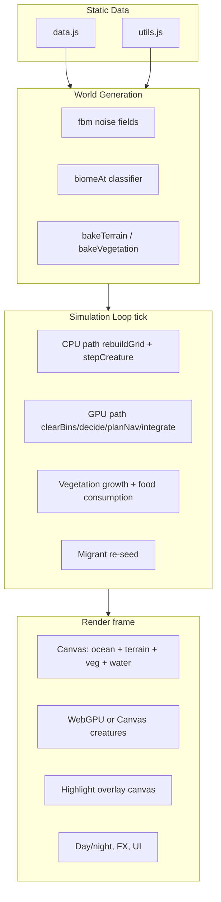

# Wildlands EcoSim — Agent Reference

> **Purpose:** Canonical design doc for AI agents working on this repo. Read this before scanning source. Update this file when architecture or simulation behavior changes.

## Quick Start

| Item | Value |
|------|-------|
| Entry point | `wildlands-ecosim.html` (serve over HTTP — ES modules block `file://`) |
| Modules | `js/` — ES module classes (see tree below) |
| Run | `python -m http.server 8765` from repo root → `http://127.0.0.1:8765/wildlands-ecosim.html` |
| Stack | Vanilla JS ES modules, Canvas 2D + WebGPU compute simulation + WebGPU creature overlay |
| Game design | `GAMEPLAY.md` — player-facing rules and planned Challenge mode |

```
EcoSim/
├── wildlands-ecosim.html   # HTML/CSS shell + DOM (~230 lines)
├── js/
│   ├── app.js              # GameApp boot + main loop
│   ├── state.js            # Shared mutable state + grid helpers
│   ├── dom.js              # DOM helper ($)
│   ├── data.js             # Biomes, species, genes (exported constants)
│   ├── utils.js            # Seeded RNG, fbm noise (exported functions)
│   ├── nav.js              # Passability, LOS, bounded grid pathfinding
│   ├── world.js            # World — procedural generation + veg growth
│   ├── camera.js           # Camera — pan/zoom/clamp transforms
│   ├── creatures.js        # CreatureSystem — AI, genetics, spatial hash
│   ├── simulation.js       # Simulation — tick, day/night, migrants
│   ├── ui.js               # UI — panels, inspector, graph, log
│   ├── input.js            # InputManager — canvas/panel/keyboard input
│   ├── tools.js            # Editor tools (spawn, rain, meteor, cull)
│   ├── fx.js               # Effects — spark/rain particles
│   ├── gpu/
│   │   └── simulation-backend.js # GpuSimulationBackend — compute sim + readback bridge
│   └── render/
│       ├── terrain-renderer.js   # TerrainRenderer — terrain/water/veg bake
│       ├── creature-renderer.js  # CreatureRenderer — 2D sprites, highlights, pedigree
│       ├── webgpu-renderer.js    # WebGpuRenderer — instanced creature quads
│       ├── quality.js            # QualityController — adaptive perf tiers
│       └── pipeline.js           # RenderPipeline — layer orchestration
├── GAMEPLAY.md             # Game design doc (sandbox today + Challenge mode plan)
└── AGENTS.md               # This file
```

---

## Architecture Overview

Single-page sim: procedural tile world → CPU or GPU creature/world simulation tick → layered render.



**Global state lives in `js/state.js`** (`state` object) — modules import it and expose domain classes. `ready` gates sim/render after worldgen.

---

## World Model

### Grid

- **Tile arrays** (length `W * H`, index `idx(x,y) = y*W+x`):
  - `elev`, `temp`, `moist` — `Float32Array`
  - `biome` — `Uint8Array`
  - `veg`, `vegCap` — `Float32Array` (0..cap per tile)
- **World size presets** (`cfg.size`):

| Key | Area (km²) | Side (km) | Tiles/km | Default tiles |
|-----|------------|-----------|----------|---------------|
| `s` | 25 | 5 | 32 | 160×160 |
| `m` | 64 | 8 | 32 | 256×256 |
| `l` | 100 | 10 | 32 | 320×320 |
| `xl` | 400 | 20 | 32 | 640×640 |
| `xxl` | 900 | 30 | 24 | 720×720 |

- `worldKmPerTile = sideKm / sideTiles`
- Adaptive perf knobs scale with `W*H`: `TX` (terrain subpixels), `growStride`, `vegBakeInterval`

### Worldgen config (`cfg`)

```js
{ sea: 0.46, temp: 0.5, moist: 0.5, relief: 0.6, animals: 0.45, size: 'm' }
```

Sliders in left panel map to these. `SEED` drives `setRngSeed(SEED)` at generation.

### Elevation / climate / biomes

1. **Elevation:** 5-octave fbm + radial continental falloff (land clusters center) + relief-scaled detail
2. **Moisture:** fbm + global `cfg.moist`
3. **Temperature:** latitude gradient (cold poles) + altitude cooling above sea + noise + `cfg.temp`
4. **Biome:** `biomeAt(e,t,m)` — Whittaker-style temp×moisture bands + elevation thresholds (ocean/beach/mountain/peak/snow)
5. **Lakes:** inland tiles with `e < 0.62` and high lake-noise → `B.LAKE`

### Biome enum (`B` in `data.js`)

| ID | Name | Water | veg cap |
|----|------|-------|---------|
| 0–2 | Deep/Ocean/Lake | yes | 0 |
| 3 | Beach | no | 0.08 |
| 4–14 | Desert…Peak | no | 0.02–1.0 |

`isWater(b) => b <= B.LAKE`. Full colors/caps in `BIOME_INFO`.

---

## Creature Simulation

### Population limits

- `MAX_POP = 6000` hard cap for births/spawns
- Dead creatures pruned periodically (`creatures.filter`); selected dead creature kept for inspector
- `stockLife()` seeds scaled by density + world area (`sqrt(area/64)`), clamped to ~45% of `MAX_POP`

### Species (`SPECIES` in `data.js`)

| Key | Diet | Hunts | Prey of | Shape |
|-----|------|-------|---------|-------|
| rabbit, deer | 0 herbivore | — | fox,wolf / wolf | small/tall |
| boar | 2 omnivore | — | wolf | stocky |
| fox, wolf, hawk | 1 carnivore | see data | — | small/tall/bird |

**Diet semantics:** `0` graze only · `1` hunt · `2` graze if no prey, else hunt/search

### Genome

- Keys: `size, speed, sense, metab, litter, lifespan, temp, tol, hue, agg`
- Ranges in `GENE_RANGE`; labels in `GENE_LABEL`
- **Spawn:** `newGenome(sp)` — species base ±12% gaussian (+ hue noise)
- **Breed:** `breedGenome(a,b)` — average + 5% mutation; 2% chance of 18% jump mutation

### Creature object

```js
{
  id, sp, x, y, vx, vy, dir, genome, gen,
  age, hp, hunger, thirst, energy,
  state, tx, ty, target, mateCd, pregnant, litterQ,
  walk, dead, cause,
  parentIds[], offspringIds[],
  matePartner?, matePartnerId?
}
```

- **Age:** `age += dt/24` → ~24 sim-seconds per game-year
- **Adult:** `age >= lifespan * 0.25`; juvenile size ×0.55
- **Effective size:** `eSize(c) = genome.size * (juvenile ? 0.55 : 1)`

### Needs & death (`stepCreature`)

| Need | Decay | Empty penalty |
|------|-------|-----------------|
| hunger | `0.9*load` (+ hunt bonus) | hp −6/s |
| thirst | `1.0*load` | hp −7/s |
| energy | movement + base | capped at 0 |
| climate | stress if `\|localT - genome.temp\| > tol` | hp −14*stress/s |

- Heal +4 hp/s when hunger/thirst >55 and no climate stress
- Death: hp≤0, or age≥lifespan
- Carcass: +0.15 veg on tile

### AI state machine (priority order)

1. `flee` — predator in sense range (`preyOf` includes attacker, attacker larger)
2. `thirst` — thirst <30
3. `graze` / `hunt` / `huntSearch` — hunger <55 (diet-dependent)
4. `rest` — energy <18
5. `mate` — compatible mate nearby, needs met
6. `hunt` — carnivore with prey, hunger <75
7. `wander` — default

**Perception:** `nearby(c, senseR)` via spatial hash (see below). Night: speed ×0.6, wander→rest if energy <75.

**Movement:** Goals are chosen by the state machine, then [`js/nav.js`](js/nav.js) **`planGridStep`** computes the next walkable tile (bounded reverse BFS with line-of-sight fast path). CPU uses `moveTowardGoal`; GPU runs a matching **`planNavStep`** compute pass that writes waypoints into `(tx, ty)` before integration. Water and peaks are impassible for ground walkers; birds swim. Thirsty creatures drink in place when `atWaterEdge()` — no movement while adjacent to water.

**Passability:** `BIOME_INFO[].passable` plus optional `state.passMask` (bit 0 = blocked). Packed into GPU `worldData` stride index 5 on upload. Mark future impassible tiles by setting `passMask[i] |= 1` and calling `gpuSimulationBackend.uploadWorld()`.

**Predation:** In range → rng catch `0.10 + agg*0.10` → prey −30−size×15 hp; kill refills hunter hunger/energy.

**Mating:** Within 1 tile; lower `id` carries pregnancy. Herbivores: gestation 2–3.5s, cooldown 3–5s. Carnivores: 3.5–5.5s / 6–10s. Litter size from `genome.litter`.

### Spatial hash

- `CELL = 6`, `grid: Map<gkey, Creature[]>`
- `rebuildGrid()` each tick before creature steps
- `nearby(c, r)` queries cell neighborhood
- GPU backend uses a uniform-cell bin buffer (`cellCounts`, fixed-cap `cellEntries`) for local neighbor scans

### Vegetation

- **Graze:** bite up to `3.5*dt` veg; hunger += bite×26; sets `vegDirty`
- **Growth:** one row per tick (`growRow`), rate `cap * 0.22 * dt * growStride * (0.6+moist)`
- **Bake:** `bakeVegetation()` when dirty (throttled by `vegBakeInterval`)
- GPU backend treats vegetation as tangible food-state buffers (`veg`, `vegCap`) with deterministic tile-owner claims before bite writes

### Migrant system (every ~6s)

If species count ≤1 and total pop <70% MAX_POP:
- Herbivores: 60% chance, spawn 2–3
- Predators: 25% chance, spawn 1, only if prey species count >2

Prevents permanent food-web collapse.

### Time

- `timeOfDay` cycles in 40s (`dt/40` per tick) → `day = floor(tGlobal/40)`
- `lightLevel`, `isNight` affect movement/rest only (not sim correctness)

---

## Rendering

### Canvases

| Element | z-index | Role |
|---------|---------|------|
| `#world` | 1 | Terrain, water, veg, 2D creatures (detail path), day/night tint, FX, tool ring |
| `#world-gpu` | 2 | WebGPU instanced creature circles (transparent overlay) |
| `#world-hl` | 3 | Species/selection highlight glows above GPU layer (`pointer-events: none`) |
| `#perfhud` | 40 | F2 perf HUD (backend, frame ms, quality tier, visible count) |

### Layers (bottom → top)

1. **Infinite ocean** — off-map deep water via `drawInfiniteOcean()` (cached viewport)
2. **Terrain** — pre-baked `terrC` at `TX` subpixels/tile, pixel-art flecks
3. **Vegetation** — 1px/tile green overlay, alpha ∝ veg/cap
4. **Water shimmer** — animated `waterC`, shoreline foam, fps scaled by quality
5. **Creatures** — WebGPU instanced circles OR Canvas pixel sprites (LOD by zoom + quality tier); dim less at night than terrain; selected + pedigree stay full brightness
6. **Species/selection highlights** — glow rings on `#world-hl` (WebGPU circle path) or `#world` (Canvas / zoomed sprite path); never disabled when panel hover, species lock, or creature selection is active (see `effectiveHighlight`)
7. **Selection relation lines** — solid behavior-target line (selected creature only; color by behavior) + animated pedigree dashes to parents (gold) and offspring (blue); drawn on `#world` (may sit under GPU circles when WebGPU path is active)
8. **FX** + tool brush ring

### WebGPU hybrid (`rendererMode='webgpu_hybrid'`)

- Falls back to Canvas if no `navigator.gpu`
- `simulationMode='gpu_hybrid'` enables GPU simulation when WebGPU is available; fallback is CPU simulation
- **Three creature render paths** (chosen each frame in `RenderPipeline.render()`):
  1. **`webgpu_circles`** (default under load / normal zoom) — GPU draws filled circles; highlights on `#world-hl` via `renderHighlightsOverlay()`
  2. **`webgpu_canvas_sprites`** — when `detail >= 2 && cam.z > 4.2`: GPU overlay cleared, full Canvas pixel sprites + highlights on `#world`
  3. **`canvas`** — full Canvas fallback if GPU init/submit fails
- In GPU sim mode, compute writes a render buffer directly and `WebGpuRenderer.renderGpuBuffer()` draws without CPU repacking creature instances
- Compute uses **one bind group, 8 storage buffers + 1 uniform** (WebGPU per-stage limit): `creatures`, packed `worldData` (temp/moist/veg/cap/biome), `cellCounts`, `cellEntries`, packed `simAtomics` (counters/species sums/prey+food owners), `simLists` (alive/dead/birth), read-only `speciesTables`, `renderData`, plus `params` uniform
- **Compute pass order** (`GpuSimulationBackend.step()`): `clearCells` → `clearCounters` → `binCreatures` → `decideAndClaim` → **`planNavStep`** → `resolveIntegrate` → `spawnFromBirthQueue` → `growVegetation` → `composeRenderData`
- While GPU sim is initializing (`gpuSimInitPending`), CPU creature ticks are skipped so seeded populations are not depleted before upload
- GPU creature records now keep stable `gpuSlot` indices; CPU sync writes changed slots only (no full stale re-upload each tick), which prevents migration/prune snap-back
- GPU behavior state is decoded from compute state codes (`wander/flee/thirst/graze/hunt/rest/mate/huntSearch`) for inspector/tooltips instead of showing a raw `gpu` placeholder
- Large populations + poor FPS → quality tier rises → creatures simplify to circles/markers (intentional LOD, not a bug)
- **F2** toggles perf HUD (`#perfhud`), including GPU sim metrics (sim step ms, alive, births, herbivore intake)

### Quality tiers (`QualityController` in `quality.js`)

Rolling average frame time (`frameMsAvg`, lerp α=0.12) maps to tiers:

| Tier | Name | `frameMsAvg` | detail | highlight | decimation |
|------|------|--------------|--------|-----------|------------|
| 0 | high | ≤16.8 ms | 2 | 2 | 1 |
| 1 | medium | ≤22 ms | 1 | 1 | 1 |
| 2 | low | ≤30 ms | 1 | 0 | 1 |
| 3 | emergency | >30 ms | 0 | 0 | 2 |

- **`detail`** — creature sprite LOD (see Creature LOD below)
- **`highlight`** — `0` = off · `1` = simple stroke rings · `2` = animated glow (`drawCreatureHighlight`)
- **`decimation`** — skip every other render frame at tier 3
- Also scales water animation rate and `vegBakeInterval`

**`effectiveHighlight(baseHighlight)`** — returns `max(baseHighlight, 1)` when `hoveredGraphSpecies`, `lockedSpeciesFromPanel`, or a live `selected` creature is set. Keeps map species/selection highlights visible even at tier 2–3.

### Camera

- `cam = {x, y, z}` — world coords + zoom
- `w2sX/Y`, `s2wX/Y` transforms
- Clamped to `landBounds` with minimum visible land margin
- Pan: right/middle drag; zoom: wheel; follow: centers on `selected`

### Creature LOD

Driven by quality `detail` tier and `cam.z`:

| Condition | Draw |
|-----------|------|
| detail 0 or zoom <1.8 | 1px marker (Canvas) / small circle (WebGPU) |
| detail 1, zoom <3.5 | simple rect body (Canvas) / medium circle (WebGPU) |
| else | full pixel-art sprite by `shape` (Canvas only; requires `detail >= 2 && cam.z > 4.2` on WebGPU path) |
| zoom >6 | state emoji above creature |

---

## UI & Input

### Panels (draggable via `.panel-head`)

| Panel | ID | Purpose |
|-------|-----|---------|
| World Generator | `#genpanel` | Seed, size, sliders, Generate, Restock |
| Ecosystem | `#stats` | Pop counts, graph, species row selection |
| Inspector | `#inspect` | Selected creature stats/genes |

### Top bar stats

Day/night, population, max generation, avg vegetation %, speed slider (0–10×), Follow button.

### Ecosystem panel (`#stats`)

- **Panel modes** (`statsPanelMode`): normal · minimized (`−`) · maximized (`□`)
- **Pop graph** — species-colored lines; updates every 5 UI ticks (~1 Hz)
- **Maximized graph** — taller canvas (220 px), hover crosshair + `#popgraph-tip` sample tooltip
- **Species rows** — count + max gen per species; click/hover for map highlights (see Selection)

### Selection & map overlays

- Click creature (inspect tool) → inspector
- Double-click or **F** → follow camera (`followSelected`); camera tracks selected via `Camera.followSelected()`
- Species row **click** → lock selection to nearest of that species (`lockedSpeciesFromPanel`); gold glow on all of that species on map
- Species row **hover** → `hoveredGraphSpecies`; graph line + row outline highlight; blue glow on all of that species on map (persists at low quality via `effectiveHighlight`)
- `lockedSelectionFromPanel` prevents canvas click from clearing until click-away
- **Terrain tooltip** (`#terrain-tip`, bottom-right) — biome name + color dot under cursor; shows "Off map" outside grid
- **Creature tooltip** (`#creature-tip`) — species dot + behavior label above sprite; when following, pins to selected creature instead of hover hit-test
- Selected creature draws a solid behavior-target line (color by state) + animated pedigree dashes to parents (gold) and offspring (blue) via `CreatureRenderer`

### Tools (code present; toolbar HTML currently absent)

Default `tool='inspect'`. Implemented in `applyTool()`:

- `inspect` — select creature
- `spawn-{species}` — spawn on land
- `rain` / `drought` — fill/clear veg in radius 4
- `meteor` — kill creatures + scorch veg, radius 3
- `cull` — kill in radius 1.5

CSS for `#toolbar` exists; DOM toolbar was removed or not yet added. Re-add `<div id="toolbar">` with `.tool[data-tool=…]` buttons to expose tools.

### Sim speed

- `speed` 0–10×; high speeds use up to 6 substeps per frame for AI stability
- `tGlobal` accumulates scaled dt; sim paused at speed 0

---

## Key Functions (by file)

### `js/utils.js`

| Export | Role |
|--------|------|
| `setRngSeed`, `rng`, `ri`, `rf`, `pick`, `gauss` | Seeded PRNG |
| `clamp`, `lerp` | Math helpers |
| `hashN`, `vnoise`, `fbm` | Procedural noise |

### `js/data.js`

| Export | Role |
|--------|------|
| `B`, `BIOME_INFO`, `isWater` | Biome definitions |
| `SPECIES`, `SP_KEYS` | Species catalog |
| `SPECIES_INDEX`, `buildGpuSpeciesTables()` | GPU species lookup tables |
| `GENE_KEYS`, `GENE_RANGE`, `GENE_LABEL` | Genetics |

### `js/nav.js`

| Export | Role |
|--------|------|
| `isTileWalkable`, `tilePassFlags`, `buildPassMaskUpload` | Passability from biome + `passMask` |
| `lineOfSightClear` | Bresenham walkability check |
| `snapWalkableGoal`, `nearestWaterEdgeTarget`, `pickRandomWalkableTile` | Goal selection helpers |
| `planGridStep` | Bounded reverse BFS next-step planner (CPU; mirrored in GPU shader) |
| `atWaterEdge` | Shoreline drink detection |

### Domain modules (classes)

| Module | Class | Role |
|--------|-------|------|
| `world.js` | `World` | `generate`, `biomeAt`, `computeLandBounds`, `growVegetation` |
| `camera.js` | `Camera` | pan/zoom, `w2s`/`s2w`, `clampCam`, `centerCam` |
| `creatures.js` | `CreatureSystem` | `makeCreature`, `stepCreature`, genetics, spatial hash |
| `simulation.js` | `Simulation` | `tick`, day/night, migrant re-seed |
| `render/terrain-renderer.js` | `TerrainRenderer` | `bakeTerrain`, `bakeWater`, `bakeVegetation`, infinite ocean |
| `render/creature-renderer.js` | `CreatureRenderer` | `drawCreature`, `renderHighlights2d`, `renderHighlightsOverlay`, pedigree lines |
| `render/webgpu-renderer.js` | `WebGpuRenderer` | WebGPU instanced creature circles |
| `render/quality.js` | `QualityController` | adaptive tiers, `effectiveHighlight`, F2 perf HUD |
| `render/pipeline.js` | `RenderPipeline` | `render()` layer orchestration (3 canvases) |
| `gpu/simulation-backend.js` | `GpuSimulationBackend` | compute simulation passes, spatial bins, global awareness, conflict resolution, readback; exports `gpuBehaviorToState()` |
| `ui.js` | `UI` | stats, graph, inspector, log, terrain/creature tooltips, worldgen labels, stats panel modes |
| `input.js` | `InputManager` | canvas/panel/keyboard handlers; **F2** perf HUD toggle |
| `app.js` | `GameApp` | boot, `doGenerate`, `frame` loop; exposes `window.runGpuBenchmark(seconds)` in console |

---

## Tuning Knobs (common agent edits)

| Constant | Location | Effect |
|----------|----------|--------|
| `MAX_POP` | `state.js` | Population ceiling |
| `CELL` | `state.js` | Spatial hash cell size |
| `GPU_SIM_MAX_CREATURES` | `state.js` | GPU creature pool cap |
| `simBackend` / `simulationMode` | `state.js` | CPU/GPU simulation routing |
| Need decay rates | `stepCreature` | Survival difficulty |
| Catch probability | hunt case ~1014 | Predator efficiency |
| `growStride`, veg growth 0.22 | `growVegetation` | Regrowth speed |
| Migrant timer/thresholds | `tick` ~1126 | Extinction recovery |
| Quality tier thresholds | `quality.js` `updateTier` | Perf vs fidelity (detail, highlight, decimation) |
| `effectiveHighlight` | `quality.js` | Panel hover/lock/selection highlight floor |
| `navRadius` / `navReplanInterval` | `quality.js` | Pathfinding search radius and replan cadence (GPU params 13–14) |
| Species `base` / `hunts` / `preyOf` | `data.js` | Food web balance |

---

## Code Conventions

- **ES modules:** each domain in `js/`; html loads `js/app.js` only
- **No bundler/tests/CI** — edit and refresh browser
- **Naming:** camelCase functions/vars; ALL_CAPS for enums/constants (`B`, `MAX_POP`, `SPECIES`); domain logic in PascalCase classes
- **Braces:** Allman style for multi-line functions/classes
- **Performance patterns:** Typed arrays for grids; row-scanned veg growth; baked terrain; viewport culling; optional GPU instancing

---

## Extension Guide for Agents

### Add a species

1. Add entry to `SPECIES` in `data.js` (diet, base stats, hunts/preyOf, shape, col)
2. `SP_KEYS` auto-updates from `Object.keys(SPECIES)`
3. Add spawn weight in `CreatureSystem.stockLife()` plan object if desired
4. Optional: toolbar spawn button `data-tool="spawn-{key}"`

### Add a biome

1. Add to `B` enum + `BIOME_INFO` in `data.js`
2. Extend `World.biomeAt()` in `js/world.js`
3. Optional: terrain fleck rules in `TerrainRenderer.bakeTerrain()`

### Add a gene

1. Add to `GENE_KEYS`, `GENE_RANGE`, `GENE_LABEL` in `data.js`
2. Add base value in each species `.base`
3. Use in `stepCreature` or rendering as needed
4. Inspector auto-lists `GENE_KEYS`

### Mark a tile impassible

1. Set `state.passMask[idx(x,y)] |= 1` (see `PASS_GROUND_BLOCKED` in `nav.js`)
2. If GPU sim active, call `gpuSimulationBackend.uploadWorld()` to refresh passability buffer
3. Pathfinding (`planGridStep` / GPU `planNavStep`) will route around blocked tiles automatically

### Add a creature behavior state

1. Add detection logic in `stepCreature` priority block
2. Add `case` in action switch
3. Add label in `drawInspector` stateName map

### Change world size

- Edit `WORLD_SIZE_PRESETS` or add preset button in gen panel
- `generateWorld()` recomputes `W,H` from preset

---

## Boot Sequence

1. Import `app.js` from html, init RNG seed via `GameApp`
2. Init `#world`, `#world-gpu`, `#world-hl` canvases; `RenderPipeline.init(canvas, gpuCanvas, hlCanvas)`
3. `syncLabels()`, `initDraggablePanels()`, `webGpuRenderer.setup()` (async)
4. `doGenerate(true)` → `World.generate()` → `stockLife()` → (if GPU enabled) `gpuSimulationBackend.setupForCurrentWorld()` → `ready=true`
5. `frame()` loop: `Simulation.tick(sdt)` (CPU or GPU backend) → `RenderPipeline.render()` → `UI.updateUI()` (5 Hz)

---

## Known Gaps / Gotchas

- **Toolbar DOM missing** — tool system wired but no visible toolbar buttons (CSS `#toolbar` only)
- **`fish` shape** referenced in `findSpawnTile` but no fish species defined
- **Selected dead creature** kept in array for inspector; not counted in pop
- **GPU readback cadence** — creature/world readback is throttled to reduce stalls; inspector/graph values can lag by a fraction of a second
- **Selected creature readback** — selected/followed creature receives a faster single-slot readback cadence for smoother inspector bars/camera tracking
- **Pedigree/target lines under GPU** — behavior-target and pedigree lines draw on `#world`; may be obscured by WebGPU circles at default zoom
- **Large pop → circles** — WebGPU circle LOD + quality tier reduction is intentional; zoom in + tier 0 for full sprites
- **ES modules require HTTP** — use `python -m http.server 8765`; opening the HTML file directly will fail module loads
- **Git:** html + js/ tracked; no package.json

---

## Maintenance

**When changing simulation or architecture, update this file in the same PR/commit.**

Sections to revise:
- New files → Quick Start tree
- New species/biomes → tables
- AI/needs formula changes → Creature Simulation
- New UI panels or tools → UI & Input
- Perf/render pipeline changes → Rendering

*Last synced with codebase: 2026-07-02 (GPU sim, UX overlays, dev-server note)*
