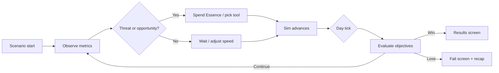

# Wildlands — Game Design Document

> **Status:** Sandbox is playable today; Challenge mode / Essence / scenarios below are **design intent**, not yet implemented.  
> **Companion docs:** `AGENTS.md` (simulation architecture), [`data/species.json`](data/species.json) (species stats, gestation, genes).  
> **Last updated:** 2026-07-02

---

## Current Sandbox (Implemented)

The live build is **Creative mode** — unlimited observation and intervention, no objectives or Essence costs.

### How to run

```powershell
cd I:\EcoSim
python -m http.server 8765
```

Open **http://127.0.0.1:8765/wildlands-ecosim.html** (append `?v=1` to bust browser cache after edits).

### Player verbs today

| Verb | How |
|------|-----|
| Generate worlds | Seed, size presets, sea/temp/moist/relief/animals sliders → **Generate** |
| Restock | Re-seed populations on current map |
| Observe | Pop graph, species rows, inspector, event log |
| Inspect creature | Default tool; click on map |
| Follow lineage | Select creature → **Follow** button, **F**, or double-click |
| Highlight species | Hover or click species row in Ecosystem panel |
| Read terrain | Bottom-right biome tooltip under cursor |
| Read behavior | Creature tooltip above sprite (or pinned while following) |
| Speed up time | Top-bar slider 0–10× |
| Debug perf | **F2** toggles perf HUD (render backend, frame ms, quality tier, GPU sim telemetry) |

### Map & UI overlays (shipped)

- **Terrain tooltip** — biome name + color swatch; "Off map" outside the grid
- **Creature tooltip** — species dot + behavior label (`Wandering`, `Hunting`, etc.); follows selected animal in follow mode
- **Species highlights** — blue glow on graph hover, gold glow on row click-lock; kept visible at low quality when panel focus or selection is active
- **Selection lines** — solid behavior-target line (color by state) + dashed pedigree links to parents (gold) and offspring (blue)
- **Ecosystem panel** — minimize / maximize; expanded graph shows hover sample tooltip
- **Infinite ocean** — off-map deep water around the landmass
- **Camera** — pan (right/middle drag), wheel zoom, clamped to land bounds; follow centers on selection

### Simulation backend

- **GPU path** (default when WebGPU available): CPU behavior-tree decisions each tick, then GPU A* nav + needs/actions/movement on compute shaders; throttled readback for inspector/graph
- **CPU fallback**: full `stepCreature` loop (BT + A* + actions) if GPU init fails or adapter limits are exceeded
- **Migrants** on — built-in extinction recovery (see Difficulty & Migrants)

### Tools (wired, toolbar DOM missing)

Logic in `js/tools.js` — inspect, spawn-{species}, rain, drought, meteor, cull. CSS for `#toolbar` exists; HTML buttons not yet in `wildlands-ecosim.html`, so only **inspect** is reachable from the UI unless toolbar is restored.

---

## Elevator Pitch

**Wildlands** is a pixel-art ecosystem steward game built on a living simulation. You don't direct animals like units — you **observe, intervene sparingly, and keep the food web in balance** across procedurally generated biomes. Same seed, same world rules; your choices (when to rain, what to spawn, when to let nature run) determine whether the land thrives or collapses.

Think *Reus* meets *SimEarth* with a chill retro UI: watch populations breathe on the graph, follow a lineage through generations, and spend limited **Essence** to nudge fate before extinction cascades.

---

## Design Pillars

| Pillar | Meaning |
|--------|---------|
| **Living world first** | The sim is the star. Game systems wrap it, never replace it. |
| **Observation is gameplay** | Inspecting creatures, reading the pop graph, and following a bloodline are core verbs — not optional fluff. |
| **Scarcity creates decisions** | Unlimited god-powers turn the sim into a toy. Essence, cooldowns, and scenario constraints force tradeoffs. |
| **Failure is readable** | Players should see *why* wolves died out (veg crash → rabbit boom → collapse), not get opaque "Game Over." |
| **Seeds are content** | Procedural worlds + fixed scenario seeds = infinite levels without hand-authored maps. |

---

## Player Fantasy

You are the **Steward** of a wild region — a spirit, ranger, or caretaker with partial influence over weather and life, but no direct control over animal AI. The ecosystem runs whether you act or not. Your job is to **guide** it toward health under pressure: droughts, predator swings, climate mismatch, and your own mistakes.

Emotional hooks:
- Relief when a near-extinct species rebounds after a well-timed rain.
- Tension when the graph shows oscillation turning into a death spiral.
- Attachment when following one creature's lineage across generations.

---

## Game Modes

### Creative (current sandbox — shipped)

**Purpose:** Exploration, streaming, learning the sim, stress-free play.

| Rule | Behavior |
|------|----------|
| Worldgen | Full access to seed, size, sea/temp/moist/relief/animals sliders |
| Tools | Free, unlimited in code; toolbar UI not exposed yet (inspect only from UI) |
| Restock | Available anytime |
| Migrants | On (sim's built-in recovery) |
| Objectives | None |
| Speed | 0–10× |
| Sim backend | GPU compute when WebGPU available; CPU fallback |

Creative is the default and only mode today. Challenge/Essence work must not regress this behavior.

### Challenge (new — primary "game" mode)

**Purpose:** Structured runs with goals, costs, and consequences.

| Rule | Behavior |
|------|----------|
| Worldgen | From **scenario** definition (fixed or constrained sliders) |
| Tools | Cost **Essence**; some have cooldowns |
| Restock | Disabled or costs heavily |
| Migrants | Configurable per scenario/difficulty (see Difficulty) |
| Objectives | Explicit win/fail checks each day |
| Speed | Capped at 5× (optional) to reduce "speed through danger" |

### Daily Seed (future)

Same scenario template, new seed each calendar day. Async score comparison ("how did you do on today's island?"). No server required — share seed + score string.

---

## Core Loop (Challenge Mode)



1. **Setup** — Load scenario: world cfg, starting populations, objective list, Essence budget, tool unlocks.
2. **Observe** — Pop graph (min/max), species row hover/lock, inspector, terrain tooltip, creature behavior tooltip (hover or follow), event log, F2 perf HUD.
3. **Intervene** — Select tool, click map; Essence deducted if allowed.
4. **Simulate** — Day/night, AI, veg growth, optional scheduled events.
5. **Judge** — End-of-day (or continuous) objective evaluation.
6. **Resolve** — Win, lose, or star rating on timeout.

---

## Resources: Essence

**Essence** is the Steward's intervention currency. It converts "infinite sandbox" into meaningful choices.

### Properties (proposed defaults)

| Property | Value |
|----------|-------|
| Starting pool | Scenario-defined (e.g. 80–120) |
| Max pool | 150 (upgradeable in meta mode later) |
| Passive regen | `0.5 + healthBonus` per sim-day |
| Health bonus | Derived from ecosystem health index (see Scoring) |

### Tool costs (initial tuning)

| Tool | Essence | Cooldown | Notes |
|------|---------|----------|-------|
| Inspect | 0 | — | Always free |
| Rain (radius 4) | 15 | 8 s | Refill veg in area |
| Drought (radius 4) | 10 | 5 s | Strip veg — risky, cheap for puzzle scenarios |
| Spawn herbivore | 25 | — | rabbit, deer, boar |
| Spawn predator | 40 | — | fox, wolf, hawk |
| Cull (radius 1.5) | 8 | 3 s | Surgical population trim |
| Meteor (radius 3) | 35 | 25 s | Emergency / puzzle tool; scorches veg |

Costs apply in `js/tools.js` → `applyTool()` via a new `GameRules.canUseTool(tool)` / `GameRules.spendEssence(amount)` gate. Creative mode bypasses the gate.

### Regen formula (draft)

```
healthIndex = avg(vegPercent/100, speciesPresence, popStability)  // 0..1
essenceRegenPerDay = 0.5 + healthIndex * 2.0
```

Reward good stewardship; starve reckless meteor spam.

---

## Objectives

Objectives are data-driven checks run after each sim-day (or every N seconds at high speed). Stored in scenario config.

### Objective types

| Type | Example | Pass condition |
|------|---------|----------------|
| `surviveDays` | "Last 30 days" | `day >= 30` |
| `speciesMin` | "Keep ≥2 wolves" | `counts.wolf >= 2` for whole run or rolling window |
| `speciesMax` | "Control rabbit boom" | `counts.rabbit <= 80` |
| `vegAvg` | "Restore the land" | avg veg ≥ 55% |
| `generation` | "Evolve the line" | `generationMax >= 8` |
| `populationBand` | "Balance" | total pop in [200, 600] |
| `toolBudget` | "Minimal intervention" | essence spent ≤ 50 |
| `noExtinctions` | "Full web" | no species at 0 for >3 consecutive days |

### Win / lose

- **Win:** All required objectives complete.
- **Lose:** Any hard-fail objective triggers (e.g. species extinct, veg < 10% for 5 days, Essence cannot afford required action — soft fail only if scenario says so).
- **Partial success:** Star rating when win condition is "survive X days" with optional bonus objectives.

### Star rating (example)

| Stars | Condition |
|-------|-----------|
| ★ | Survived to target day |
| ★★ | No species extinct + avg veg ≥ 45% |
| ★★★ | All bonus objectives + essence spent ≤ budget |

---

## Scenarios

Scenarios live in a new export `SCENARIOS` in `js/data.js` (or `js/scenarios.js`). Each scenario is a self-contained "level."

### Scenario schema (draft)

```js
{
  id: 'island_ark',
  title: 'Island Ark',
  description: 'A small island. Keep rabbits and foxes coexisting for 40 days.',
  seed: 42857,                    // fixed; omit for random
  cfg: { size: 's', sea: 0.52, temp: 0.5, moist: 0.55, relief: 0.5, animals: 0.35 },
  startingCounts: { rabbit: 24, fox: 6 },  // optional override after stockLife
  essenceStart: 90,
  migrants: 'delayed',              // 'on' | 'off' | 'delayed'
  toolsEnabled: ['inspect', 'rain', 'spawn-rabbit', 'cull'],
  objectives: [
    { type: 'surviveDays', days: 40, required: true },
    { type: 'speciesMin', species: 'rabbit', min: 4, required: true },
    { type: 'speciesMin', species: 'fox', min: 2, required: true },
    { type: 'vegAvg', min: 35, required: false, label: 'Healthy undergrowth' },
  ],
  events: [
    { day: 15, type: 'drought', duration: 8, severity: 1.5 },
  ],
}
```

### Launch scenarios (content plan)

| ID | Fantasy | Twist |
|----|---------|-------|
| `tutorial_grove` | Learn inspect + rain | Forgiving migrants, 20 days |
| `island_ark` | Classic predator–prey | Small map, no spawns except budget |
| `rewilding` | Wolves extinct at start | Must graze veg up before wolf spawn unlocks |
| `cold_spring` | Low temp world | Deer need high `tol`; climate stress visible in inspector |
| `boar_wrecking_ball` | Too many omnivores | Cull + rain management |
| `hands_off` | No spawn/meteor tools | Pure observation + rain/drought only |

---

## Scheduled Events

Events inject drama without breaking sim determinism (seed + event table).

| Event | Effect |
|-------|--------|
| `drought` | Veg growth ×0.3; optional ambient veg decay |
| `heavy_rain` | Free partial veg refill in random biome band |
| `wildfire` | Meteor-like veg clear in random land patch (no Essence cost) |
| `migration_herd` | One-time spawn of scenario species at edge |
| `disease` | Temporary hp drain for one species |
| `cold_snap` | Global temp shift for N days |

**Hook:** `Simulation.tick()` in `js/simulation.js` — after day increment, `GameEvents.update(day)`.

Event announcements use existing log pipeline in `js/ui.js` / `creatures.log()`.

---

## Difficulty & Migrants

The sim already re-seeds extinct species via `Simulation.tick()` migrant logic (`js/simulation.js`). For a game, this must be a **difficulty knob**, not a hidden crutch.

| Setting | Migrants | Essence regen | Event severity |
|---------|----------|---------------|----------------|
| Easy | On (default) | ×1.25 | ×0.75 |
| Normal | Delayed (first after day 20) | ×1.0 | ×1.0 |
| Hard | Off | ×0.85 | ×1.25 |

When migrants are off, extinction is a fail unless the scenario allows local loss (e.g. "hawks optional").

---

## Scoring & Metrics

### Run score (for Daily Seed / leaderboards)

```
score = Math.floor(
  daysSurvived * 100
  + biodiversityBonus * 50
  + starObjectives * 200
  - essenceSpent * 0.5
  - extinctionCount * 300
)
```

**Biodiversity bonus:** +1 per species present above minimum threshold at run end.

### Ecosystem health index (UI + regen)

Computed each UI tick from data already in `js/ui.js`:

- `vegPercent` — average vegetation / cap
- `speciesPresence` — fraction of species with count ≥ 2
- `popStability` — inverse of max single-step drop in total pop from `popHistory`

Display as a small meter in Challenge mode (new UI element).

---

## UI — Current vs Challenge (Planned)

### Shipped in sandbox

| Element | Placement | Purpose |
|---------|-----------|---------|
| World Generator | `#genpanel` | Seed, size, sliders, Generate, Restock |
| Ecosystem stats | `#stats` | Pop graph (min/max modes), species rows, hover/lock highlights |
| Inspector | `#inspect` | Selected creature stats/genes |
| Top bar | `#topbar` | Day/night, pop, gen, veg %, speed, Follow |
| Terrain / creature tips | overlay | Biome + behavior readouts |
| World Story | `#worldstory` | Collapsible timeline of births, deaths, and clickable world events |
| Timeline DB | `#timelinedb` | Collapsible browser for current-run timeline tables (world, creature, heartbeat, meta) |
| Perf HUD | `#perfhud` | F2 — backend, frame ms, quality tier, GPU sim stats |

### Planned for Challenge mode

| Element | Placement | Purpose |
|---------|-----------|---------|
| **Mode selector** | Title / gen panel | Creative vs Challenge vs (future) Daily |
| **Scenario picker** | Gen panel or modal | List from `SCENARIOS` |
| **Objectives panel** | Left or right stack | Checklist + progress bars |
| **Essence bar** | Top bar | Current / max + regen hint |
| **Toolbar** | Bottom center | Restore `#toolbar` DOM; disable locked tools |
| **Results overlay** | Full screen | Win/lose, score, stars, graph snapshot |
| **Tool cooldown pips** | On toolbar buttons | Small radial or numeric cooldown |

Existing panels remain in Challenge: World Generator (collapsed), Ecosystem stats, Inspector, event log, map overlays above.

### Top bar (Challenge)

Replace or extend stats row:

`Day 12/30 · Pop 342 · Essence 67 · Health ■■■□ · ⏱ 2×`

---

## Future Modes (out of v1 scope, design now)

### Lineage Run

- Player selects one creature at start (`state.selected` → `state.lineageRoot`).
- Win: lineage reaches gen N with ≥ K living descendants.
- Lose: last descendant dies.
- Optional "Bless" action (1× per 10 days, small gene nudge on one offspring).

Uses existing pedigree fields (`parentIds`, `offspringIds`, `gen`) in creature objects.

### Roguelike Meta

- Between runs: pick one perk (e.g. +10 starting Essence, unlock boar spawn, migrants +10 s delay).
- Run modifiers rolled per attempt ("Long nights", "Aggressive predators").
- Persist `localStorage` meta save.

---

## What Stays Simulation-True

These sim behaviors are **not** overridden for game feel without explicit scenario flags:

- Creature AI via JSON behavior trees ([`data/behaviors/`](data/behaviors/); CPU evaluation, GPU execution)
- Genetics (`breedGenome`, mutation rates)
- Climate stress from local temp vs genome
- Spatial hash perception (CPU BT; GPU bins for integrate)
- Grid A* pathfinding around water, peaks, and `passMask` blocked tiles ([`js/nav.js`](js/nav.js); GPU `planNavStep`)
- Day/night movement penalties
- Carcass → veg feedback on death
- `MAX_POP = 6000` cap

Game layer reads sim state; it does not fake population numbers.

---

## Implementation Roadmap

Phased delivery on top of the existing module layout.

### Already landed (architecture + sandbox UX)

| Area | Status |
|------|--------|
| ES module split (`js/` domains) | Done |
| WebGPU hybrid render (circles / sprites / fallback) | Done |
| GPU compute simulation + CPU fallback | Done |
| JSON behavior trees (CPU) + GPU A* pathfinding | Done |
| Shared grid A* pathfinding (CPU/GPU) | Done |
| Adaptive quality tiers + F2 perf HUD | Done |
| Terrain tooltip, infinite ocean, camera clamp/follow | Done |
| Pop graph, species hover/lock highlights, inspector | Done |
| Pedigree + behavior-target lines | Done |
| Ecosystem panel min/max + graph tooltip | Done |
| Migrant recovery, genetics, day/night | Done |

### Phase 0 — Foundation (MVP "it's a game")

| Task | Primary files |
|------|----------------|
| Add `gameMode`, `essence`, `scenarioId`, `runState` to state | `js/state.js` |
| `SCENARIOS` with one tutorial scenario | `js/data.js` or `js/scenarios.js` |
| `GameRules` — essence gate, objective checks | `js/game-rules.js` (new) |
| Wire tool costs in `applyTool` | `js/tools.js` |
| Restore toolbar HTML + `initToolButtons()` | `wildlands-ecosim.html`, `js/tools.js` |
| Objectives panel + Essence in top bar | `wildlands-ecosim.html`, `js/ui.js` |
| Win/lose overlay | `js/ui.js` |
| Challenge start from `GameApp` boot path | `js/app.js` |
| Disable restock / migrants per scenario | `js/simulation.js`, `js/app.js` |

**MVP win condition:** Scenario `tutorial_grove` — survive 20 days, no species below 2, essence + rain only.

### Phase 1 — Content & polish

- 3–5 scenarios, event queue, star ratings, results recap with graph export.
- Scenario picker UI, difficulty selector.
- Cooldown UI on tools.

### Phase 2 — Lineage + Daily Seed

- Lineage mode variant in `GameRules`.
- Daily seed from date hash; score share string.

### Phase 3 — Meta (optional)

- Roguelike perks, `localStorage` persistence, unlock tree.

---

## Audio & Juice (later)

Not required for MVP. Placeholders:

- Soft chime on objective complete
- Low rumble on extinction fail
- Rain/meteor SFX tied to `js/fx.js` effect spawn
- Ambient biome loop by dominant biome under camera

---

## Open Questions

1. **Pause at speed 0** — Does Challenge allow indefinite pause, or auto-advance "thinking time" limit?
2. **Undo** — Single-step undo for tools would help learning but complicates determinism. Likely skip for v1.
3. **Multiplayer** — Async seed-only for v1; real-time shared world out of scope.
4. **Mobile** — Touch already partially wired in `js/input.js`; toolbar + panels need layout pass.
5. **Naming** — Product title "Wildlands" vs "Wildlands: Steward" for store/listing.

---

## Success Criteria (playtest)

- [ ] A new player completes `tutorial_grove` in under 15 minutes without docs.
- [ ] At least two viable strategies exist (e.g. rain-heavy vs spawn predator once).
- [ ] Failure causes feel fair — player identifies food web mistake in recap.
- [ ] Creative mode unchanged for existing users.
- [ ] One Daily Seed scenario is replayable for a week without feeling solved.

---

## Behavior JSON (modding)

Per-species AI is data-driven under [`data/behaviors/`](data/behaviors/):

- **`library.json`** — shared conditions, actions, thresholds, and tree templates (`herbivore_prey`, `carnivore`, `omnivore`)
- **`rabbit.json`**, **`wolf.json`**, etc. — `"extends"` a template, override thresholds (e.g. `restEnergy`), tweak action `speedMult`, or patch tree order via `tree.insertAfter`

Each species in [`data/species.json`](data/species.json) references its file with `"behavior": "rabbit"`. Reload the page after edits.

---

## Document Maintenance

Update this file when:

- Sandbox UX or controls change (tooltips, follow, graph, panels)
- Objectives, costs, or scenario schema change
- New game modes ship
- Migrants / difficulty rules change
- MVP scope shifts

Keep `AGENTS.md` focused on sim architecture; keep `GAMEPLAY.md` focused on player-facing rules and content.

*Sandbox synced with codebase: 2026-07-02. Challenge-mode numbers remain preliminary until playtests.*
