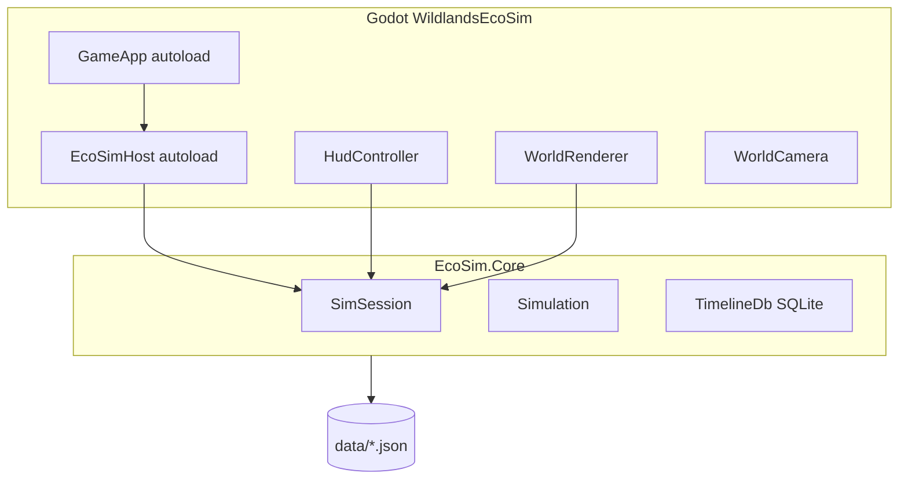

# Wildlands EcoSim — Godot Agent Reference

> **Primary product:** Godot 4.7 C# desktop game at [`godot/WildlandsEcoSim/`](godot/WildlandsEcoSim/).  
> **Simulation source of truth:** [`EcoSim.Core`](godot/WildlandsEcoSim/EcoSim.Core/) (pure C#, no Godot refs).  
> **Legacy web:** [`LEGACY.md`](LEGACY.md) — `wildlands-ecosim.html` / `batch-test.html` frozen.

## Quick start

| Item | Value |
|------|-------|
| Editor | Godot 4.7 stable **Mono** — `C:\Godot_v4.7-stable_mono_win64\Godot_v4.7-stable_mono_win64.exe` |
| Project | [`godot/WildlandsEcoSim/project.godot`](godot/WildlandsEcoSim/project.godot) |
| Run | Open project → **F5** (or headless smoke below) |
| Data junction | `godot/WildlandsEcoSim/data` → `../../data` (see [`scripts/setup_godot_dev.ps1`](scripts/setup_godot_dev.ps1)) |
| Tests | `dotnet test EcoSim.sln` from repo root |
| Windows export | `powershell scripts/export_windows.ps1` → `build/WildlandsEcoSim.exe` |
| Headless batch | `python scripts/run_batch_godot.py --days 100 --size s` |

```powershell
# One-time dev setup
powershell scripts/setup_godot_dev.ps1

# Editor run
# Open godot/WildlandsEcoSim in Godot 4.7, press F5

# Headless smoke
& "C:\Godot_v4.7-stable_mono_win64\Godot_v4.7-stable_mono_win64_console.exe" `
  --headless --path godot/WildlandsEcoSim --quit-after 3
```

---

## Architecture

```
EcoSim.Core/          Pure C# sim (species, BT, worldgen, batch harness)
EcoSim.BatchCli/      Headless CLI batch driver
godot/WildlandsEcoSim/
  EcoSim.Core/        ProjectReference (sources excluded from game csproj)
  scripts/            Godot glue (autoloads, HUD, render)
  scenes/Main.tscn    World viewport + HUD
tests/EcoSim.Core.Tests/
data/                 Shared JSON (species + behaviors)
```



### Autoloads

| Node | Role |
|------|------|
| `EcoSimHost` | Bootstraps `SpeciesCatalog` + `BehaviorLibrary`; owns `SimSession`; `GenerateWorld()` |
| `GameApp` | `_Process` tick loop, pause, snapshot capture via `TimeScrubController` |

### Main scene (`scenes/Main.tscn`)

- `WorldViewport` — `SubViewport` + `WorldRenderer` + `WorldCamera`
- `Hud` — `HudController` wires panels, top bar, timeline strip, toolbar

---

## Simulation (EcoSim.Core)

CPU-only creature sim. One tick per `GameApp._Process` substep:

1. `Simulation.Tick(dt)` — day/night, `CreatureSystem.StepCreature`, veg growth, migrants, prune
2. Behavior trees run inside `StepCreature` (`BehaviorTree.Tick`)
3. `TimeScrubController.CaptureIfDue()` — SQLite snapshots at 1 s sim intervals

Key types: `SimState`, `Creature`, `CreatureSystem`, `WorldGenerator`, `Simulation`, `SimSession`.

Constants in `SimConstants.cs` (`MAX_POP`, `CELL`, `SimDaySeconds=40`).

### Shared data

Loaded via `DataPaths` / `EcoSimBootstrap.LoadBaseData()`:

- `data/species.json`
- `data/behaviors/library.json` + `{species}.json`

`EcoSimHost.ResolveDataRoot()` resolves `res://data` (editor + exported builds).

---

## Rendering (Godot)

| Component | Role |
|-----------|------|
| `TerrainBaker` | TX=4 terrain bake, veg overlay, water shimmer |
| `CreatureRenderer` | `MultiMeshInstance2D` species-colored dots |
| `WorldRenderer` | Terrain/veg/water layers, day/night `CanvasModulate`, click-to-select |
| `WorldCamera` | Pan/zoom, follow selected (F / Follow button) |

---

## UI panels (`scripts/ui/`)

| Panel | Script |
|-------|--------|
| World Generator | `GenPanel` — sliders, size km² buttons, Generate / Restock |
| Ecosystem | `EcosystemPanel` + `PopGraph` + shared `PopHistoryTracker` (~1 Hz sampling) |
| Inspector | `InspectorPanel` — Stats + Life Story tabs |
| Species Stats | `SpeciesStatsPanel` — on species row lock |
| World Story | `WorldStoryTracker` |
| Profiler | `ProfilerPanel` — F2 toggle |
| Toolbar | `ToolsController` — inspect, rain, drought, meteor, cull (no manual spawn) |
| Timeline | `TimelineStrip` — scrub + Present |

Theme: `EcoSimThemeBuilder` (stone panels, gold accents). Layout persisted in `user://panel-layout.cfg`.

---

## Timeline & persistence

| Component | Path |
|-----------|------|
| SQLite DB | `user://timeline.db` |
| Snapshots | `SnapshotService` + `TimelineDb` |
| Scrub | `TimeScrubController` — seek restores nearest snapshot; GOD/tools call `OnMutatingAction()` |

---

## Batch / balance (headless)

| Tool | Command |
|------|---------|
| Unit tests | `dotnet test EcoSim.sln` |
| Batch CLI | `dotnet run --project EcoSim.BatchCli -- --seed 42 --size s --days 100` |
| Python wrapper | `python scripts/run_batch_godot.py` |

Phase 6 (Godot in-editor batch/balance UI) is not yet implemented. Web `batch-test.html` is legacy.

---

## Build & export

**Requirements:** .NET 8 SDK, Godot 4.7 Mono editor, **Windows Desktop export templates** installed in editor.

```powershell
powershell scripts/export_windows.ps1
# Output: build/WildlandsEcoSim.exe (+ .pck if not embedded)
```

`WildlandsEcoSim.csproj` must use `Godot.NET.Sdk/4.7.0` and **exclude** `EcoSim.Core/**/*.cs` from compile (reference only) to avoid double-compile editor crashes.

---

## Git workflow

Integration branch: `godot-migration`. Phase branches `godot/phase-N-*` merge when milestone passes `dotnet test` + manual F5 check.

| Phase | Status |
|-------|--------|
| 0–3 | Bootstrap, sim core, playable sandbox |
| 4–4b | HUD + JS UI parity |
| 5 | Timeline scrub (SQLite) |
| 6 | Godot batch/balance UI (deferred) |
| 7 | Windows export, GODOT.md, legacy archive |

---

## Tuning knobs (common edits)

| Knob | Location |
|------|----------|
| `MAX_POP`, `CELL` | `EcoSim.Core/Sim/SimConstants.cs` |
| Need decay / hunt | `CreatureSystem.cs`, `BehaviorExecutor.cs` |
| Veg growth | `WorldGenerator.cs` |
| Species stats | `data/species.json` |
| Behavior thresholds | `data/behaviors/*.json` |
| Snapshot interval | `TimeScrubController.DefaultSnapshotIntervalSec` |

---

## Known gaps

- No Godot-native batch/balance designer (Phase 6)
- Press Start 2P font not bundled (uses default theme font)
- Timeline DB browser panel not ported
- Exported build requires export templates; data ships via `res://data` in PCK

*Last synced: Phase 7 ship (2026-07-05)*
